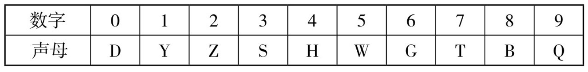

### 数字 110 图像编码：

0：铁圈
1：铅笔
2：鸭子
3：耳朵
4：红旗
5：手
6：口哨
7：拐杖
8：葫芦
9：勺子
10：棒球
11：筷子
12：婴儿
13：医生
14：钥匙
15：鹦鹉
16：杨柳
17：陈浩南
18：尾巴
19：药酒
20：耳环
21：阿姨
22：鸳鸯
23：耳塞
24：耳饰
25：二胡
26：二流
27：耳机
28：二八大杠自行车
29：二舅
30：山洞
31：鲨鱼
32：扇儿
33：仙丹
34：绅士
35：珊瑚
36：山路
37：山鸡
38：沙发
39：三角
40：司令
41：司仪
42：柿儿
43：石山
44：石狮
45：师傅
46：石榴
47：司机
48：扫把
49：石球
50：五环
51：狐狸
52：孤儿
53：牡丹
54：武士
55：木屋
56：蜗牛
57：武器
58：苦瓜
59：五角
60：榴莲
61：轮椅
62：女儿
63：刘三姐
64：律师
65：老虎
66：溜溜球
67：楼梯
68：喇叭
69：牛角
70：麒麟
71：蜥蜴
72：企鹅
73：鸡蛋
74：骑士
75：积木
76：气流
77：蛐蛐
78：青蛙
79：气球
80：百灵
81：白蚁
82：靶儿
83：华山
84：消毒液
85：白虎
86：八路
87：白痴
88：爸爸
89：白酒
90：精灵
91：九姨太
92：球儿
93：救生圈
94：教师
95：酒壶
96：旧炉
97：酒席
98：酒吧
99：舅舅
00：望远镜
01：羚羊
02：铃儿
03：灵山
04：零食
05：灵符
06：灵力
07：令旗
08：篱笆
09：灵柩

### 字母数字声母对应系统

### 声母对应数字的记忆：

0—D：0 象形 D。
1—y：1 的发音首字母是 y。
2—Z：象形。
3—S：3 的手音首字母是 S。
4—h：倒象形。
5—w：5 的手音首字母是 W。
6—g：倒象形。
7—t：象形。
8—b：象形。
9—q：象形。

### 千位数字宫殿编码制作范例

123 对应字母：yzs=椅子上=坐垫。
546 对应字母：whg=无花果。
457 对应字母：hwt 话务台=电话。
965 对应字母：qgw 情歌王=情歌王子张信哲。
786 对应字母：tbg 特别高=姚明。

### 千位数字宫殿记忆信息范例

123 椅子上=坐垫。
124 一直挥=旗帜。
125 杨宗纬。
126 一只狗。
127 圆柱体。
128 圆珠笔。

### 千位数字宫殿随机成语记忆

相亲相爱——123（yzs）椅子上=坐垫联想：坐垫上有两个人在相亲相爱。
