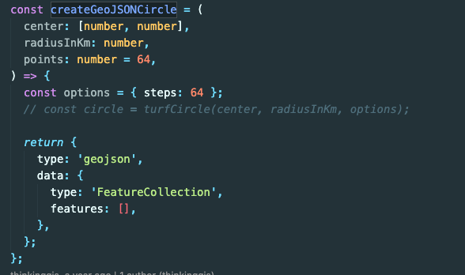
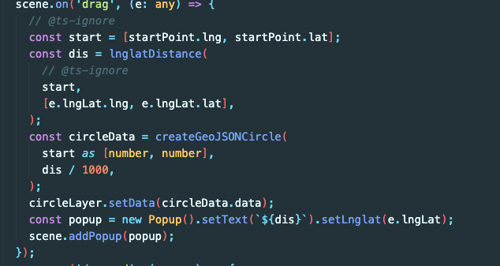

### 吐槽

先吐槽下 L7，用下来感觉就是个 KPI 项目，坑超多，文档中 N 多 404 也没人管，很多方法都没有暴露出来，只可远观，用起来就全是坑

### 需求

根据经纬度和距离，在地图上显示一个圆形的范围

### 思考

一开始想用`PointLayer`的，后来发现 size 不能根据距离来生成

然后想到了绘制组件中的`DrawCircle`，去看了下源码，找到了如下这段：

`/L7/stories/Draw/Components/DrawCircle.tsx`




原来 L7 本身的圆就是通过多边形圆来画的，所以果断引入`turf`

### 实现

添加依赖

```bash
npm i @turf/turf -S
```

生成一个多边形圆

```js
import { circle } from '@turf/turf'

const addCircleLayer = () => {
  // 经纬度
  const center = ['121.138695', '31.246165']
  // 半径（公里）
  const dis = 3
  // steps: 边数    边数约多约圆润
  const polygonCircle = circle(center, dis, { steps: 64 })
  // 生成多边形圆
  const circleLayer = new PolygonLayer()
    .source({
      type: 'FeatureCollection',
      features: [polygonCircle],
    })
    .color('rgba(255, 189, 72, 0.2)')
    .shape('fill')
    .style({
      opacity: 0.6,
    })
  scene?.addLayer(circleLayer)
}
```

完成