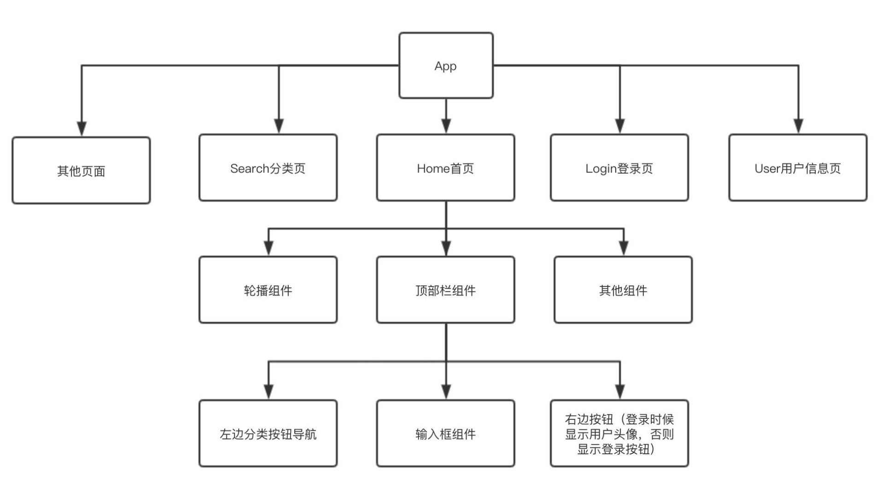

### 快速开始

```js
npx create-react-app xxx
cd xxx
yarn start
```

### 组件化优点

1. 增强代码重⽤性，提⾼开发效率
2. 简化调试步骤，提升整个项⽬的可维护性
3. 便于协同开发
4. 注意点：降低耦合性

### 组件跨层级通信



在⼀个典型的 React 应⽤中，数据是通过 props 属性⾃上⽽下（由⽗及⼦）进⾏传递的，但这种做法对
于某些类型的属性⽽⾔是极其繁琐的（例如：地区偏好，UI 主题），这些属性是应⽤程序中许多组件都
需要的。Context 提供了⼀种在组件之间共享此类值的⽅式，⽽不必显式地通过组件树的逐层传递
props。

React 中使⽤ Context 实现祖代组件向后代组件跨层级传值。Vue 中的 provide & inject 来源于 Context。

#### Context API

##### React.createContext

创建⼀个 Context 对象。当 React 渲染⼀个订阅了这个 Context 对象的组件，这个组件会从组件树中离
⾃身最近的那个匹配的 Provider 中读取到当前的 context 值。

#### Context.Provider

Provider 接收⼀个 value 属性，传递给消费组件，允许消费组件订阅 context 的变化。⼀个 Provider
可以和多个消费组件有对应关系。多个 Provider 也可以嵌套使⽤，⾥层的会覆盖外层的数据。

当 Provider 的 value 值发⽣变化时，它内部的所有消费组件都会重新渲染。Provider 及其内部
consumer 组件都不受制于 shouldComponentUpdate 函数，因此当 consumer 组件在其祖先组件退
出更新的情况下也能更新。

##### Class.contextType

挂载在 class 上的 contextType 属性会被重赋值为⼀个由 `React.createContext()` 创建的 Context
对象。这能让你使⽤ this.context 来消费最近 Context 上的那个值。你可以在任何⽣命周期中访问
到它，包括 render 函数中。==只能用在类组件当中，只能订阅单一 context==

##### Context.Consumer

这⾥，React 组件也可以订阅到 context 变更。这能让你在函数式组件中完成订阅 context。
这个函数接收当前的 context 值，返回⼀个 React 节点。传递给函数的 value 值等同于往上组件树离
这个 context 最近的 Provider 提供的 value 值。如果没有对应的 Provider， value 参数等同于传递
给 createContext() 的 defaultValue 。

##### useContext

接收⼀个 context 对象（ React.createContext 的返回值）并返回该 context 的当前值。当前的
context 值由上层组件中距离当前组件最近的 `<MyContext.Provider>` 的 value prop 决定。==只能⽤
在 function 组件中==

#### 使⽤ Context

创建 Context => 获取 Provider 和 Consumer => Provider 提供值 => Consumer 消费值
范例：共享主题⾊

```js
import React, { Component } from 'react'
import ContextTypePage from './ContextTypePage'
import { ThemeContext, UserContext } from '../Context'
import UseContextPage from './UseContextPage'
import ConsumerPage from './ConsumerPage'
export default class ContextPage extends Component {
  constructor(props) {
    super(props)
    this.state = {
      theme: {
        themeColor: 'red',
      },
      user: {
        name: 'xiaoming',
      },
    }
  }
  changeColor = () => {
    const { themeColor } = this.state.theme
    this.setState({
      theme: {
        themeColor: themeColor === 'red' ? 'green' : 'red',
      },
    })
  }
  render() {
    const { theme, user } = this.state
    return (
      <div>
        <h3>ContextPage</h3>
        <button onClick={this.changeColor}>change color</button>
        <ThemeContext.Provider value={theme}>
          <ContextTypePage />
          <UserContext.Provider value={user}>
            <UseContextPage />
            <ConsumerPage />
          </UserContext.Provider>
        </ThemeContext.Provider>
        <ContextTypePage />
      </div>
    )
  }
}
```

Context.js

```js
import React from 'react'
export const ThemeContext = React.createContext({ themeColor: 'pink' })
export const UserContext = React.createContext()
```

pages/ContextTypePage.js

```js
import React, { Component } from 'react'
import { ThemeContext } from '../Context'
export default class ContextTypePage extends Component {
  static contextType = ThemeContext
  render() {
    const { themeColor } = this.context
    return (
      <div className="border">
        <h3 className={themeColor}>ContextTypePage</h3>
      </div>
    )
  }
}
```

pages/ConsumerPage.js

```js
import React, { Component } from 'react'
import { ThemeContext, UserContext } from '../Context'
export default class ConsumerPage extends Component {
  render() {
    return (
      <div className="border">
        <ThemeContext.Consumer>
          {(themeContext) => (
            <>
              <h3 className={themeContext.themeColor}>ConsumerPage</h3>
              <UserContext.Consumer>
                {(userContext) => <HandleUserContext {...userContext} />}
              </UserContext.Consumer>
            </>
          )}
        </ThemeContext.Consumer>
      </div>
    )
  }
}
function HandleUserContext(userCtx) {
  return <div>{userCtx.name}</div>
}
```

消费多个 Context

```html
<ThemeProvider value="{theme}">
  <ContextTypePage />
  <ConsumerPage />
  {/*多个Context */}
  <UserProvider value="{user}">
    <MultipleContextsPage />
  </UserProvider>
</ThemeProvider>
```

如果两个或者更多的 context 值经常被⼀起使⽤，那你可能要考虑⼀下另外创建你⾃⼰的渲染组件，以
提供这些值。

pages/UseContextPage

```js
import React, { useState, useEffect, useContext } from 'react'
import { ThemeContext, UserContext } from '../Context'
export default function UseContextPage(props) {
  const themeContext = useContext(ThemeContext)
  const { themeColor } = themeContext
  const userContext = useContext(UserContext)
  return (
    <div className="border">
      <h3 className={themeColor}>UseContextPage</h3>
      <p>{userContext.name}</p>
    </div>
  )
}
```

#### 注意事项

因为 context 会使⽤参考标识（reference identity）来决定何时进⾏渲染，这⾥可能会有⼀些陷阱，当
provider 的⽗组件进⾏重渲染时，可能会在 consumers 组件中触发意外的渲染。举个例⼦，当每⼀次
Provider 重渲染时，以下的代码会重渲染所有下⾯的 consumers 组件，因为 value 属性总是被赋值
为新的对象：

```js
class App extends React.Component {
  render() {
    return (
      <Provider value={{ something: 'something' }}>
        <Toolbar />
      </Provider>
    )
  }
}
```

为了防⽌这种情况，将 value 状态提升到⽗节点的 state ⾥：

```js
class App extends React.Component {
  constructor(props) {
    super(props)
    this.state = {
      value: { something: 'something' },
    }
  }
  render() {
    return (
      <Provider value={this.state.value}>
        <Toolbar />
      </Provider>
    )
  }
}
```

#### 总结

在 React 的官⽅⽂档中， Context 被归类为⾼级部分(Advanced)，属于 React 的⾼级 API，建议不要滥
⽤。
后⾯我们要学习到的 react-redux 的 <Provider /> ，就是通过 Context 提供⼀个全局态的 store ，路
由组件 react-router 通过 Context 管理路由状态等等。在 React 组件开发中，如果⽤好 Context ，可以
让你的组件变得强⼤，⽽且灵活。
