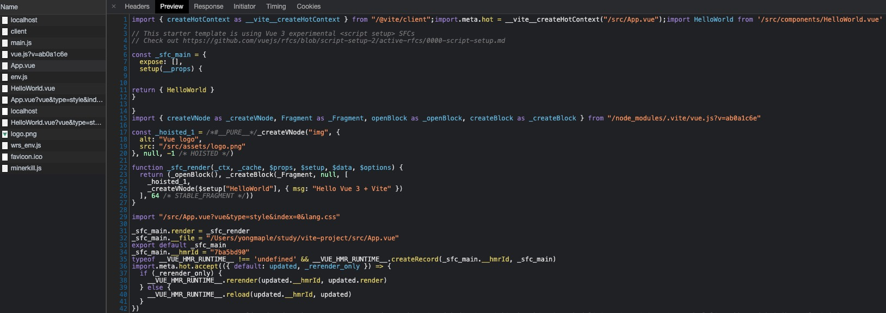

#### Vite是什么
Vite是一个开发构建工具，开发中它利用浏览器**native ES Module**特性按需导入源码，预打包依赖。
特点：
- 启动快
- 更新快

#### 创建
```bash
npm init @vite/app
```

#### 将资源引入为URL
服务时引入一个静态资源会返回解析后的公共路径：
```js
// 解析为地址
import logo from './assets/logo.png'  // 输出/src/assets/logo.png
```
使用这个路径
```html

```
可以打开Chrome Network，看App.vue，可以看到里面的地址是被解析后的公共路径


#### 设置别名
vite.config.js：
```js
import resolve from 'path'
export default defineConfig({
  ...
  resolve: {
    alias: {
      '@': resolve('./src'),
      'comps': resolve('./src/components')
    }
  }
})
```
style中同样可以使用别名来引入图片等

#### TS整合
默认整合ts，可以直接使用，`<script lang="ts">`即可，需要固定ts版本的话，在`package.json`的`devDependencies`中直接添加`"typescript": "4.1.5"`即可

tsconfig.json可以自行配置后放入项目即可

#### 代理
`vite.config.js`中添加如下代码：
```js
export default defineConfig({
  ...
  server: {
    proxy: {
      "/api": {
        target: "***",
        changeOrigin: true,
        rewrite: (path) => path.replace(/^\api/, ""),
      },
    },
  },
  ...
})
```
#### 数据mock

安装依赖
```bash
npm i mockjs -S
npm i vite-plugin-mock -D
```
引入插件，`vite.config.js`中添加如下代码：
```js
import { viteMockServe } from 'vite-plugin-mock'
export default defineConfig({
  ...
  plugins: [ viteMockServe({}) ]
  ...
})
```
项目下创建`mock`文件夹，文件夹下就可以创建mock数据了，例如：
```js
export default [
  {
    url: "/api/users",
    method: "get",
    response: req => {
      return {
        code: 0,
        data: [{ name: "foo" }, { name: "bar" }]
      }
    }
  }
]
```

#### 代码规范
使用`eslint + prettier`规范代码
添加如下依赖：
```json
{
  "devDependencies": {
    "@typescript-eslint/eslint-plugin": "^4.15.2",
    "@typescript-eslint/parser": "^4.15.2",
    "@vue/eslint-config-prettier": "^6.0.0",
    "@vue/eslint-config-typescript": "^7.0.0",
    "@vuedx/typescript-plugin-vue": "^0.6.3",
    "eslint": "^7.20.0",
    "eslint-plugin-prettier": "^3.3.1",
    "eslint-plugin-vue": "^7.6.0",
    "prettier": "^2.2.1"
  }
}
```

未完待续