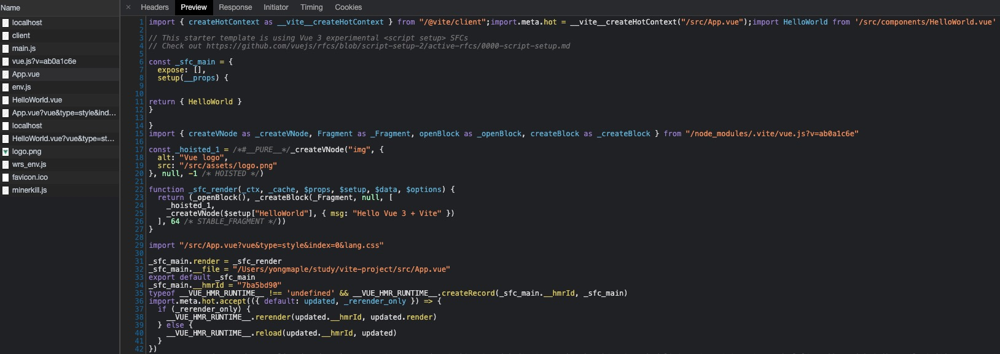
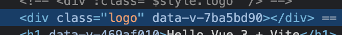
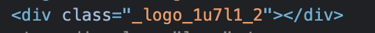

#### Vite 是什么

Vite 是一个开发构建工具，开发中它利用浏览器**native ES Module**特性按需导入源码，预打包依赖。
特点：

- 启动快
- 更新快

#### 创建

```bash
npm init @vitejs/app
```

这里选择 vue

#### 将资源引入为 URL

服务时引入一个静态资源会返回解析后的公共路径：

```js
// 解析为地址
import logo from './assets/logo.png' // 输出/src/assets/logo.png
```

使用这个路径

```html

```

可以打开 Chrome Network，看 App.vue，可以看到里面的地址是被解析后的公共路径



#### 设置别名

vite.config.js：

```js
import { resolve } from 'path'
export default defineConfig({
  ...
  resolve: {
    alias: {
      '@': resolve('./src'),
      'comps': resolve('./src/components')
    }
  }
})
```

App.vue

```js
import HelloWorld from 'comps/HelloWorld.vue'
import Logo from '@/assets/logo.png'
```

启动时要用`npm run dev`，使用`vite`启动控制台会报错如下：

```
[vite] Failed to resolve module import "@/assets/logo.png". (imported by /src/App.vue)
```

style 中同样可以使用别名来引入图片等

```css
.logo {
  background-image: url(@/assets/logo.png);
  width: 200px;
  height: 200px;
}
```

#### 全局样式

在 main.js 里引入

新建`/src/index.css`，把`App.vue`中的`#app {}`移入`index.css`，依然生效

#### scoped 与 module 样式

使用 scoped 时，元素会被强制加上`data-v-xxxx`，选择器的深度发生一些变化

使用 module 时，class 会 hash

两者相差不大，相对而言，module 可能更好一些

scoped 写法：

```html
<template>
  ...
  <div class="logo" />
  ...
</template>
<style scoped>
  .logo {
    background-image: url(@/assets/logo.png);
    width: 200px;
    height: 200px;
  }
</style>
```

module 写法：

```html
<template>
  ...
  <div :class="$style.logo" />
  ...
</template>
<style module>
  .logo {
    background-image: url(@/assets/logo.png);
    width: 200px;
    height: 200px;
  }
</style>
```





#### 加载模块化 css

约定，在名称与 css 之间加上 module，例如：`App.module.css`

新建`src/App.module.css`，将`.logo {}`移入，改写`App.vue`

```html
<template>
  
  <div :class="classes.logo" />
  <HelloWorld msg="Hello Vue 3 + Vite" />
</template>

<script setup>
  import HelloWorld from 'comps/HelloWorld.vue'
  import Logo from '@/assets/logo.png'
  // 加载模块化css
  import classes from './App.module.css'
</script>
```

#### 使用 less/sass

`npm i less -D`

然后就可以直接用了，sass 同理

#### postcss

只要在项目中添加`postcss.config.js`就可以了

添加需要的插件`npm i autoprefixer -D`

```js
module.exports = {
  plugins: [require('autoprefixer')],
}
```

#### TS 整合

默认整合 ts，可以直接使用，`<script lang="ts">`即可，需要固定 ts 版本的话，在`package.json`的`devDependencies`中直接添加`"typescript": "4.1.5"`即可

tsconfig.json 可以自行配置后放入项目即可

```json
{
  "compilerOptions": {
    "target": "esnext",
    "module": "esnext",
    "strict": true,
    "jsx": "preserve",
    "moduleResolution": "node",
    "types": ["vite/client"],
    "isolatedModules": true
  },
  "include": [
    "src/**/*.ts",
    "src/**/*.d.ts",
    "src/**/*.tsx",
    "src/**/*.vue",
    "tests/unit"
  ]
}
```

#### 代理

`vite.config.js`中添加如下代码：

```js
export default defineConfig({
  ...
  server: {
    proxy: {
      "/api": {
        target: "***",
        changeOrigin: true,
        rewrite: (path) => path.replace(/^\api/, ""),
      },
    },
  },
  ...
})
```

#### 数据 mock

安装依赖

```bash
npm i mockjs -S
npm i vite-plugin-mock -D
```

引入插件，`vite.config.js`中添加如下代码：

```js
import { viteMockServe } from 'vite-plugin-mock'
export default defineConfig({
  ...
  plugins: [ viteMockServe({}) ]
  ...
})
```

项目下创建`mock`文件夹，文件夹下就可以创建 mock 数据了，例如：

```js
export default [
  {
    url: '/api/users',
    method: 'get',
    response: (req) => {
      return {
        code: 0,
        data: [{ name: 'foo' }, { name: 'bar' }],
      }
    },
  },
]
```

#### 代码规范

使用`eslint + prettier`规范代码

添加如下依赖：

```json
{
  "devDependencies": {
    "@typescript-eslint/eslint-plugin": "^4.15.2",
    "@typescript-eslint/parser": "^4.15.2",
    "@vue/eslint-config-prettier": "^6.0.0",
    "@vue/eslint-config-typescript": "^7.0.0",
    "@vuedx/typescript-plugin-vue": "^0.6.3",
    "eslint": "^7.20.0",
    "eslint-plugin-prettier": "^3.3.1",
    "eslint-plugin-vue": "^7.6.0",
    "prettier": "^2.2.1"
  }
}
```

添加配置文件`.eslintrc.js`

```js
module.exports = {
  root: true,
  env: {
    browser: true,
    es2021: true,
    node: true,
  },
  extends: [
    'plugin:vue/vue3-recommended',
    'eslint:recommended',
    '@vue/typescript/recommended',
    '@vue/prettier',
    '@vue/prettier/@typescript-eslint',
  ],
  parserOptions: {
    ecmaVersion: 2021,
  },
  plugins: [],
  rules: {
    'no-unused-vars': 'off',
    '@typescript-eslint/no-unused-vars': 'off',
  },
}
```

package.json 中添加如下命令

`"lint": "eslint --ext .ts,vue src/** --no-error-on-unmatched-pattern"`

`"lint:fix": "eslint --ext .ts,vue src/** --no-error-on-unmatched-pattern --fix"`

#### 单元测试

添加依赖

```json
{
  "devDependencies": {
    "jest": "^26.6.3",
    "@types/jest": "^26.0.20",
    "vue-jest": "^5.0.0-alpha.7",
    "babel-jest": "^26.6.3",
    "@babel/preset-env": "^7.12.17",
    "@vue/test-utils": "^2.0.0-beta.9",
    "ts-jest": "^26.5.1",
    "@babel/preset-typescript": "^7.12.17"
  }
}
```

创建配置文件`jest.config.js`

```js
module.exports = {
  transform: {
    // 用 vue-jest 处理 *.vue 文件
    '^.+\\.vue$': 'vue-jest',
    '^.+\\.jsx?$': 'babel-jest',
    '^.+\\.tsx?$': 'ts-jest',
  },
  // support alias
  moduleNameMapper: {
    '^@/components(.*)$': '<rootDir>/src/components$1',
  },
  testMatch: ['**/test/unit/**/*.[jt]s?(x)'],
}
```

`tsconfig.json`中需要加上

```json
{
  "compilerOptions": {
    "types": ["vite/client", "jest"]
  }
}
```

package.json 中添加单测命令

`"test:unit": "jest"`

例子：

`/test/unit/example.spec.ts`

```ts
import HelloWorld from '@/components/HelloWorld.vue'
import { shallowMount } from '@vue/test-utils'

describe('aaa', () => {
  test('should', () => {
    const wrapper = shallowMount(HelloWorld, {
      props: {
        msg: 'hello,vue3',
      },
    })
    expect(wrapper.test()).toMatch('hello,vue3')
  })
})
```

添加`babel.condig.js`

```js
module.exports = {
  presets: [
    ['@babel/preset-env', { targets: { node: 'current' } }],
    '@babel/preset-typescript',
  ],
}
```

在 git 提交时 lint 和单测

添加依赖`npm i lint-staged yorkie -D`

package.json 添加配置

```json
"gitHooks": {
  "pre-commit": "lint-staged",
  "pre-push": "npm run test:unit"
},
"lint-staged": {
  "*.{js,vue}": "eslint --fix"
}
```

**全文完**