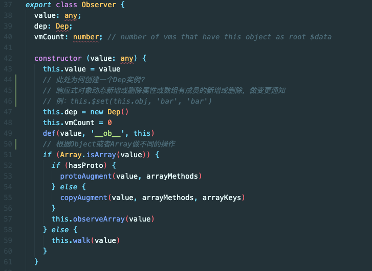

### 获取 Vue

项目地址：[https://github.com/vuejs/vue](https://github.com/vuejs/vue)

当前版本号：2.6.12

### 安装依赖

```bash
npm i
npm i roll-up -g
```

使用`npm run dev`就会在`dist`目录下生成编译后的`vue.js`

### 文件结构

```
.
├── BACKERS.md
├── LICENSE
├── README.md
├── benchmarks
├── dist          发布目录
├── examples      范例，里面有测试代码
├── flow          针对flow的类型声明（类似ts）
├── package.json
├── packages      核心代码之外的独立库
├── scripts       构建脚本
├── src           源码
│   ├── compiler          编译器相关（渲染函数、SFC的编译器、dom编译器）
│   ├── core              核心代码
│   │   ├── components      通用组件如keep-alive
│   │   ├── config.js
│   │   ├── global-api      全局API
│   │   ├── index.js
│   │   ├── instance        构造函数等
│   │   ├── observer        响应式相关
│   │   ├── util
│   │   └── vdom            虚拟DOM相关
│   ├── platforms           平台
│   │   ├── web
│   │   └── weex            基本凉凉了
│   ├── server
│   ├── sfc
│   └── shared
├── types         ts类型声明
└── yarn.lock
```

需要源码映射，所以在 package.json 中添加`--sourcemap`

`"dev": "rollup -w -c scripts/config.js --sourcemap --environment TARGET:web-full-dev",`

本文项目地址：[https://github.com/YongMaple/vue](https://github.com/YongMaple/vue) 内含测试用代码`/examples/test/`

术语解释：

- runtime: 仅包含运行时，不包含编译器
- common: cjs 规范，用于 webpack1
- esm: ES 模块，用于 webpack2+
- umd: universal module definition，兼容 cjs 和 amd，常见直接用在浏览器

例：

- `/dist/vue.common.js` 中间加 common 的，给服务端使用的，在 nodejs 环境执行的
- `/dist/vue.esm.browser.js` esm，给打包工具使用的，如 webpack。
- browser，给支持 type=module 这种模块化方式导入的浏览器
- `/dist/vue.js` global，同时兼容 amd 和 cjs(commonjs)的格式。umd 的打包方式
- `/dist/vue.runtime.js` runtime，运行时，不含编译器，template 中加入字符串模板这类操作会报错

### `src/platforms/web/entry-runtime-with-compiler.js`

从 package.json `dev`中找到`/scripts/config.js`

`rollup -w -c scripts/config.js --sourcemap --environment TARGET:web-full-dev`命令中传入了环境变量`web-full-dev`

在`/scripts/config.js`中查找，可以在配置中找到入口文件`web/entry-runtime-with-compiler.js`

文件地址前有个 resolve 方法

```js
const resolve = (p) => {
  // 拆分/
  // web/entry-runtime-with-compiler.js
  const base = p.split('/')[0] // web
  if (aliases[base]) {
    return path.resolve(aliases[base], p.slice(base.length + 1))
  } else {
    return path.resolve(__dirname, '../', p)
  }
}
```

以下是`aliases`的内容

```js
const path = require('path')

const resolve = (p) => path.resolve(__dirname, '../', p)

module.exports = {
  vue: resolve('src/platforms/web/entry-runtime-with-compiler'),
  compiler: resolve('src/compiler'),
  core: resolve('src/core'),
  shared: resolve('src/shared'),
  web: resolve('src/platforms/web'),
  weex: resolve('src/platforms/weex'),
  server: resolve('src/server'),
  sfc: resolve('src/sfc'),
}
```

现在找到了入口文件的位置`src/platforms/web/entry-runtime-with-compiler.js`

```js
const mount = Vue.prototype.$mount
Vue.prototype.$mount = function (
  ...
}
```

源码中这段是为了扩展$mount，为了解析 el、template 选项

问题 1：为什么可以不用写`$mount`

答：如果设置了 el，挂载的宿主就指定为 el

```js
const app = new Vue({
  el: '#app',
  // template: '<div>template</div>
  template: '#app',
  render(h) {
    return h('div', 'render')
  },
})
```

问题 2：el、template、render 同时出现，哪个优先级高

答：render > template > el


### `src/platforms/web/runtime/index.js`

找到当前文件中的 Vue 引入`import Vue from './runtime/index'`

进入这个文件看一下

```js
// install platform patch function
// 安装平台特有的补丁函数，未来用于组件更新
Vue.prototype.__patch__ = inBrowser ? patch : noop

// public mount method
// 实现了$mount
Vue.prototype.$mount = function (
  el?: string | Element,
  hydrating?: boolean
): Component {
  el = el && inBrowser ? query(el) : undefined
  // 挂载组件：把当前组件(this)挂载到el上
  // 流程： mountComponent 执行this的render， 得到vnode， _update(vnode)转换成真实dom， _update内部调用的是__patch__
  return mountComponent(this, el, hydrating)
}
```

_Vue 在执行挂载时：执行渲染函数得到虚拟 dom，再执行更新函数，将其转换为真实 dom_

继续找 Vue，当前文件的引入为`import Vue from 'core/index'`

此处 core 是`src/core`的别名

### `src/core/index.js`

主要做了初始化全局 API

```js
// 初始化全局API
// Vue.use directive components mixin 等
initGlobalAPI(Vue)
```

继续找 Vue，当前文件的引入为`import Vue from './instance/index'`

### `src/core/instance/index.js`

这个文件中

- 声明了 Vue 的构造函数
- 声明了 Vue 的各种实例方法($set、$watch 等等)

```js
// 声明Vue的构造函数
function Vue(options) {
  if (process.env.NODE_ENV !== 'production' && !(this instanceof Vue)) {
    warn('Vue is a constructor and should be called with the `new` keyword')
  }
  this._init(options)
}

// 声明Vue各种实例方法
initMixin(Vue)
stateMixin(Vue)
eventsMixin(Vue)
lifecycleMixin(Vue)
renderMixin(Vue)

export default Vue
```

这里`_init`从何而来，是在`initMixin()`中

### `src/core/instance/init.js`


内部就是声明了各种和他有关系的组件，父、祖、子等

就是实例属性的初始化


在使用自定义事件时，类似这种写法`<Child @my-click="onClick"></Child>`

回调函数（onClick）在父组件中声明的，所以用在 initEvents 中使用`_parentListeners`

`updateComponentListeners`是事件的监听

事件的监听和派发都是组件本身

例如：

```js
child.$emit('my-click')
child.$on('my-click', listeners)
```


在 render 中处理`$slots`和`$scopedSlots`这个比较好理解，在渲染前肯定是要把内部插槽先解析

`$_c`和`$createElement`就是 render(h)中的那个 h，可以得到虚拟 dom

`$_c`给编译器生成的渲染函数去使用

`$createElement`给用户生成的渲染函数去使用

问：new Vue 的时候都发生了什么？

答：首先构造函数的初始化会得到一个 Vue 的实例，我们给他传入 options，我们会得到一个组件实例，在内部会做根实例的初始化

1. 初始化时会做：当前实例的关键属性初始化，例如$parent,$root,$slots,$scopeSlots 等等
2. 同时对当前自定义组件的自定义事件的监听
3. 派发一些生命周期钩子，beforeCreate、created
4. 在这两个钩子中间，对组件的状态进行初始化，比如 data/props/methods/computed/watch，对他们进行数据响应式处理

### 数据响应式

可以先看下之前的这篇文章进行大致的了解

[https://yongmaple.com/2021/04/07/手写 Vue/](https://yongmaple.com/2021/04/07/手写Vue/)

开始研究`initState`


可以看到 initState 里面，对 props、methods、data、computed、watch 进行了初始化

问：props、methods、data 中如果有重名的属性，优先谁？

答：props > methods > data。从上往下处理，在处理时如果发现有重名的，就会报错


通常 data 都是 function，只有在根组件的时候可以是对象

问：为什么这里的 data 可以是对象？为什么 data 一般都是个函数，需要 return 出去，不能直接写对象？

- 组件复用时所有组件实例都会共享 data，如果 data 是对象的话，就会造成一个组件修改 data 以后会影响到其他所有组件，所以需要将 data 写成函数，每次用到就调用一次函数获得新的数据。
- 当我们使用 new Vue() 的方式的时候，无论我们将 data 设置为对象还是函数都是可以的，因为 new Vue() 的方式是生成一个根组件，该组件不会复用，也就不存在共享 data 的情况了

这里进入`observe`方法（`src/core/observer/index.js`）


可以知道，在 observe 时，每个对象会创建一个 Observer

先看测试代码`examples/test/02-1-reactive.html`中的问题


再看下`src/core/observer/index.js`



再看上面的问题，这个例子中有几个 Dep，现在就知道应该是 4 个了

每个对象创建一个 Dep，每个属性又会创建一个子 Dep，所以这里是 4 个 Dep

一个组件一个 Watcher，这个例子中只有一个 new Vue()，所以这里是 1 个 Watcher

进入 Observer 中的 this.walk


这里 walk 遍历了对象的所有 key，进行了一个响应式的处理

进入 defineReactive


这里每个 key 都 new Dep()

还可以看到`let childOb = !shallow && observe(val)`

这里又对属性做了一次 observe

如果这里 childOb 存在，就说明子 Ob 内部的 dep 和当前组件的 watcher 建立了依赖关系

Dep 与 Watcher 的关系

- 一个组件内部只有一个 Watcher
- 一个组件内部有多个 Dep
- 组件内部出了 render watcher，可能还会有 user watcher，用户会自定义($watch、watch:{})
- 所以他们之间是多对多的关系

先看下 depend


这里面 Dep.target 就是 WatcheraddDep

再看下 Watcher 的 addDep


这里面把 watcher 和 dep 相互建立了关系

- 建立 Dep 与 Watcher 的关系是为了通知更新，这个很好理解

- 建立 Watcher 与 Dep 的关系是为了清除 watcher 时使用

如何清除 watcher？

```js
const unWatch = app.$watch('text', (newVal, oldVal) => {
  console.log(`${newVal} : ${oldVal}`)
})
// 手动注销watch
unWatch()
```

### 数组响应式

数组和对象不同，操作数组时使用 7 个方法（数组变更方法），没办法得知数据变化，vue 中采取的策略是拦截这些方法并通知 dep

先看对数组的拦截和通知 `src/core/observer/array.js`


再找`arrayMethods`在哪使用的

Observer 中有对数组和对象分别做处理

```js
export class Observer {
  ...
  // 根据Object或者Array做不同的操作
    if (Array.isArray(value)) {
      // 判断是否有原型
      if (hasProto) {
        protoAugment(value, arrayMethods)
      } else {
        // IE等老版本浏览器
        copyAugment(value, arrayMethods, arrayKeys)
      }
      this.observeArray(value)
    } else {
      this.walk(value)
    }
}
```

有原型时，直接替换掉原型

```js
function protoAugment(target, src: Object) {
  /* eslint-disable no-proto */
  // 覆盖当前数组实例的原型
  target.__proto__ = src
  /* eslint-enable no-proto */
}
```

没有原型时，直接把方法定义上去

```js
function copyAugment(target: Object, src: Object, keys: Array<string>) {
  for (let i = 0, l = keys.length; i < l; i++) {
    const key = keys[i]
    def(target, key, src[key])
  }
}
```

### 全流程图


**本文完**
