目录：

- [Vue2 源码解析](https://yongmaple.com/2021/04/13/Vue2源码解析/)
- [Vue2 源码解析二](https://yongmaple.com/2021/04/15/Vue2源码解析二/)
- [Vue2 源码解析三](https://yongmaple.com/2021/04/21/Vue2源码解析三/)

本文项目地址：[https://github.com/YongMaple/vue](https://github.com/YongMaple/vue) 内含测试用代码`/examples/test/`

### 组件化机制

#### 注册

- 全局声明 `Vue.component()`
- 局部声明 `components`

`src/core/global-api/index.js`

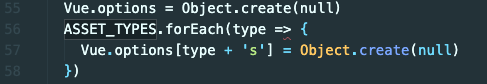

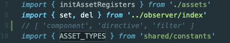

真正注册是在`initAssetRegisters`

`src/core/global-api/assets.js`

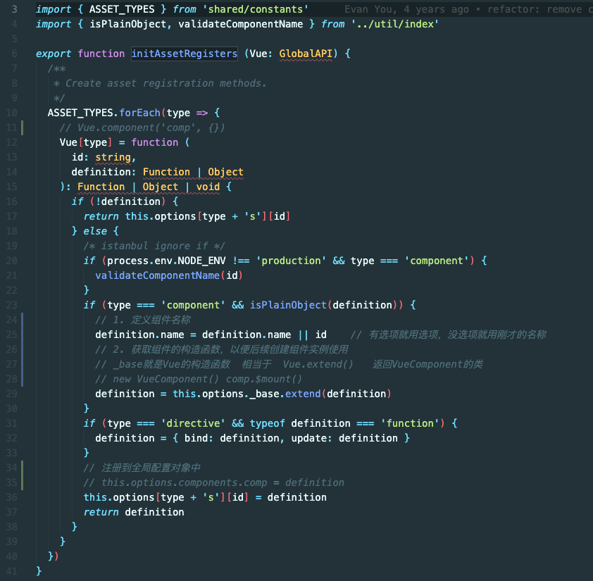

#### 实例化、挂载

在控制台打印渲染函数`console.log(app.$options.render)`可以得到如下：

```js
anonymous() {
  with(this){
    return _c('div',{
        attrs:{"id":"demo"}
      },[
        _c('h1',[_v("Vue组件化机制")]),
        _v(" "),
        _c('comp')
      ],1)}
}
```

这里的`_c`就是之前的`createElement`

`src/core/instance/render.js`

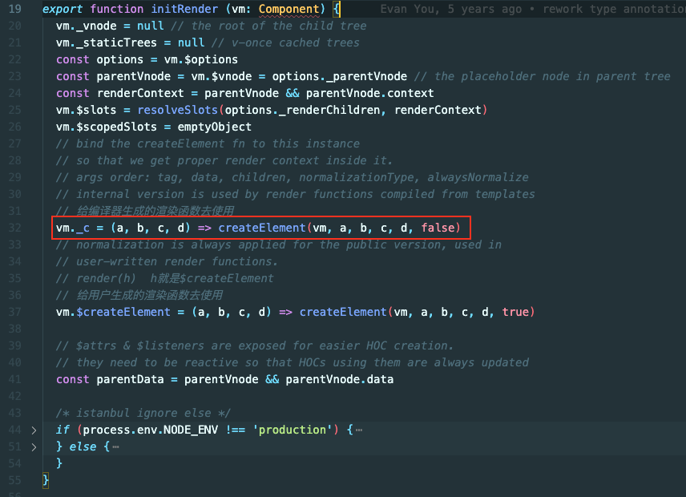

`src/core/vdom/create-element.js`

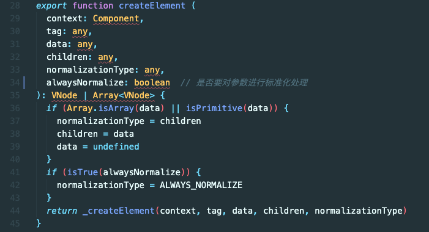

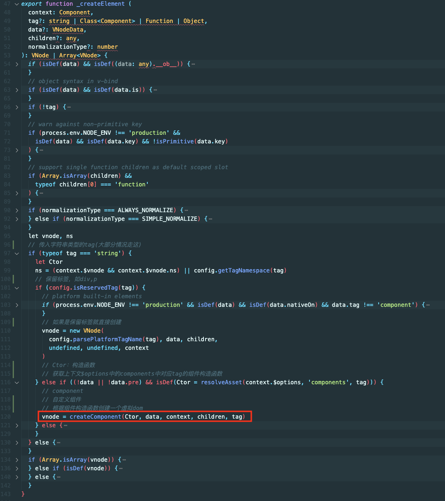

`src/core/vdom/create-component.js`

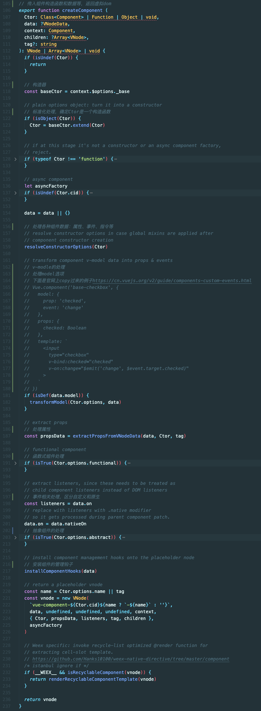

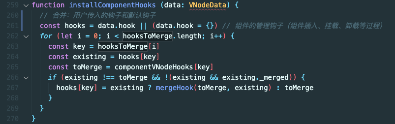


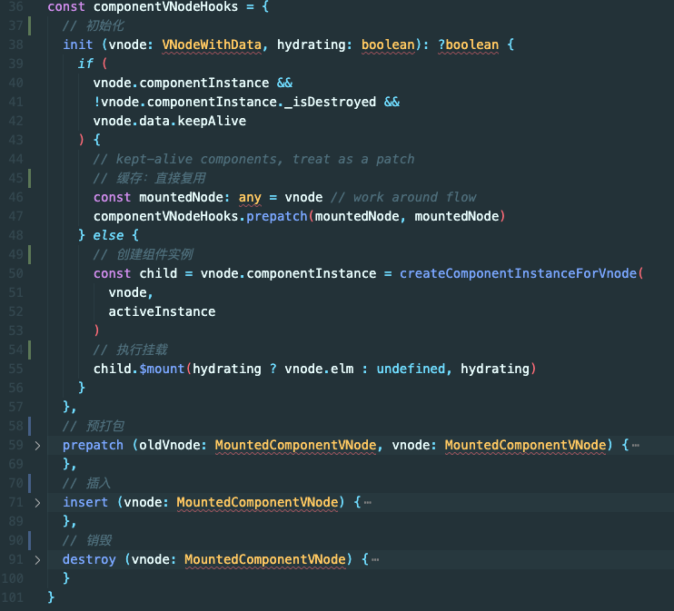

`installComponentHooks`之后，创建了虚拟 dom，最终返回 vnode

```js
// 根据组件名称，创建虚拟dom
// comp => vue-component-1-comp
const name = Ctor.options.name || tag

const vnode = new VNode(
  `vue-component-${Ctor.cid}${name ? `-${name}` : ''}`,
  data,
  undefined,
  undefined,
  undefined,
  context,
  { Ctor, propsData, listeners, tag, children },
  asyncFactory
)
```

init 何时执行？根实例执行$mount 时

流程：

1. 根实例执行$mount   `vm.$mount()`
2. `vm.$mount()` 中执行了 `mountComponent()`
3. `mountComponent()`中声明了`updateComponent()`，`new Watcher()`
4. `updateComponent()`传入`new Watcher()`并立刻调用一次
5. `updateComponent()` 中执行 `render()` 得到整棵虚拟 dom 树
6. `render()`之后执行 `_update()`
7. `_update()` 中执行`__patch__()`，`__patch__`是平台特有的补丁函数，用于组件更新

进入到 patch

`src/core/vdom/patch.js`

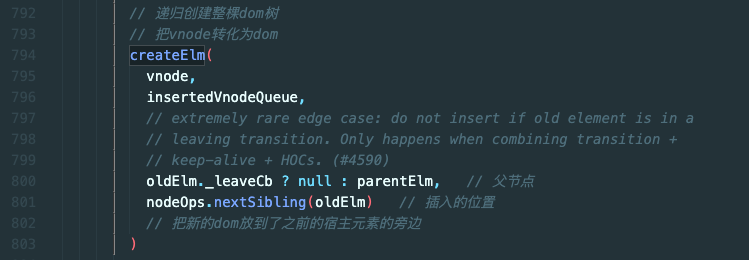

patch 中使用了 createElm 递归创建 dom 树

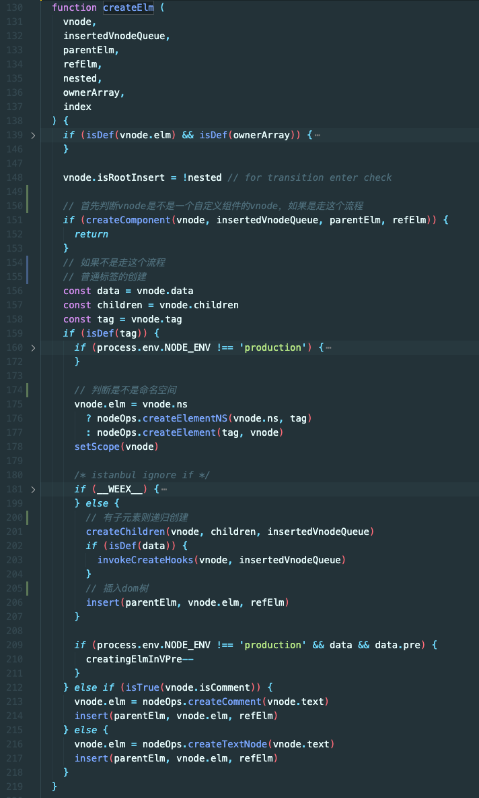

如果是一个组件，调用 createComponent

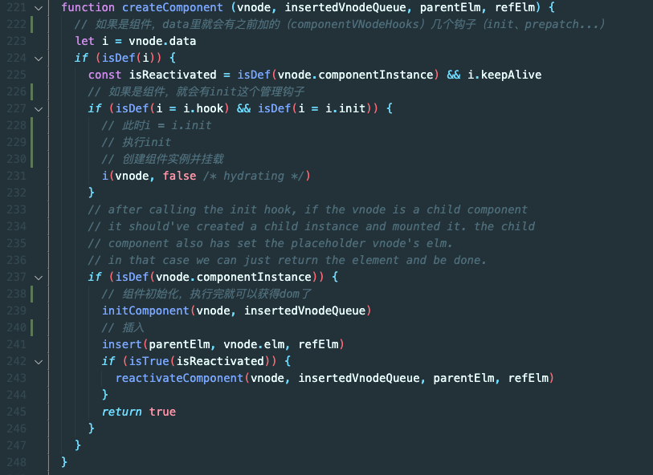

- 问：有 parent、child 父子嵌套组件，请问生命周期顺序
- 答：parent.created => child.created => child.mounted => parent.mounted 类似于洋葱模型，先进后出

**全文完**