目录：

- [Vue2 源码解析](https://yongmaple.com/2021/04/13/Vue2源码解析/)
- [Vue2 源码解析二](https://yongmaple.com/2021/04/15/Vue2源码解析二/)
- [Vue2 源码解析三](https://yongmaple.com/2021/04/21/Vue2源码解析三/)

本文项目地址：[https://github.com/YongMaple/vue](https://github.com/YongMaple/vue) 内含测试用代码`/examples/test/`

### 异步更新队列

先了解一下`Event Loop`

推荐阅读：

- [https://segmentfault.com/a/1190000016278115](https://segmentfault.com/a/1190000016278115)
- [https://jakearchibald.com/2015/tasks-microtasks-queues-and-schedules/?utm_source=html5weekly](https://jakearchibald.com/2015/tasks-microtasks-queues-and-schedules/?utm_source=html5weekly)

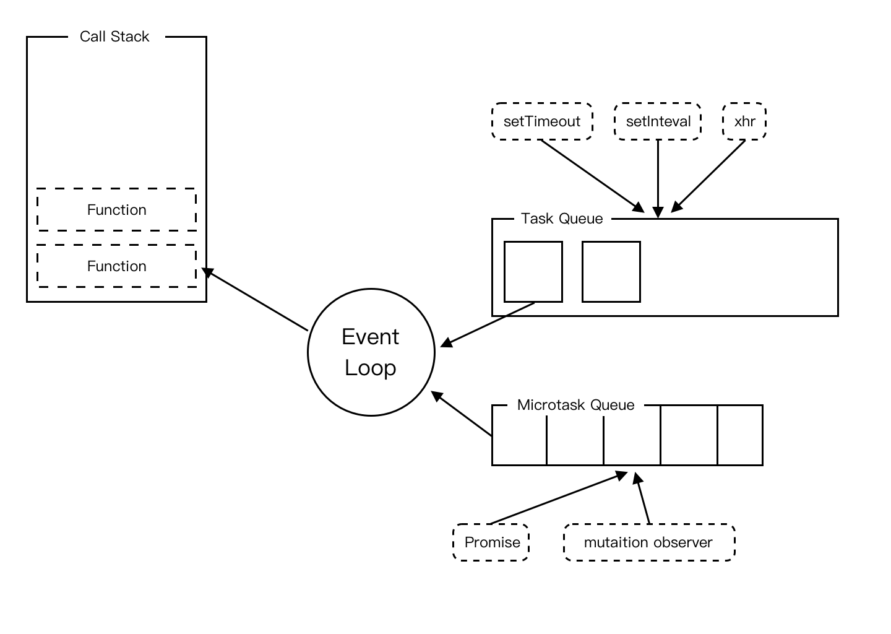

- Task Queue 宏任务队列
- Microtask Queue 微任务队列
- Call Stack 调用栈
- 浏览器端的宏任务：setTimeout、setInterval、requestAnimationFrame、I/O、UI rendering
- 浏览器端的微任务：Promise、Object.observe、MutationObserver

##### 简单总结下浏览器下的 Event loop 流程：

1. 先走完全局同步任务
2. 然后走完当前所有的微任务
3. 执行 UI rendering
4. 走队列第一个宏任务
5. 走完当前所有的微任务
6. 执行 UI rendering
7. 如此循环，如果在微任务执行期间，出现了新的微任务，直接跟在这次微任务队列的末尾（在下次宏任务之前执行）

Vue 中的具体实现

**nextTick: Vue 尝试使用 nextTick 执行一个异步任务**

**Vue 在组件更新的时候是批量的组件更新，把 watcher 放到 queue 里面，等刷新微任务队列的时候，一起执行**

- 异步：只要侦听到数据变化，Vue 将开启一个队列，并缓冲在同一事件循环中发生的所有数据变更
- 批量：如果同一个 watcher 被多次触发，只会被推入到队列中一次。去重对于避免不必要的计算和 DOM 操作是非常重要的。然后在下一个事件循环 Tick 中，Vue 刷新队列执行实际工作
- 异步策略：Vue 在内部对异步队列尝试使用原生的`Promise.then`、`MutationObserver`或`setImmediate`，如果执行环境都不支持，则会采用`setTimeout`代替

响应式相关的，从`defineReactive`开始看

`src/core/observer/index.js`
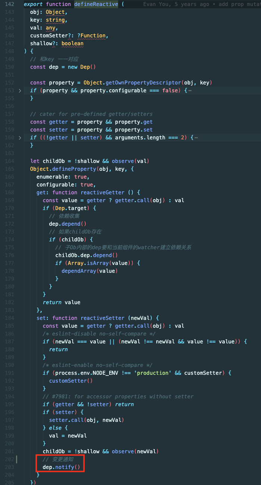

当一个值发生变化的时候，会被拦截，然后开始设一个最新的值，设完之后让 dep 去通知更新

`src/core/observer/dep.js`
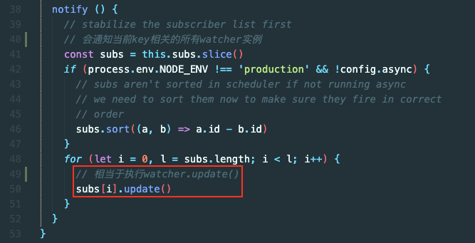

subs 里存放的是和当前 key 相关的一堆 watcher

`src/core/observer/watcher.js`
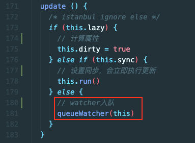

进入 Watcher 实例

lazy 不会立即得到最新的值，而是等界面中用到相关的派生值时才会，比如计算属性

sync 设置同步，会立即执行更新，比如在用$watch 时，传入 immediate: true 时

queueWatcher 是 watcher 入队操作

`src/core/observer/scheduler.js`
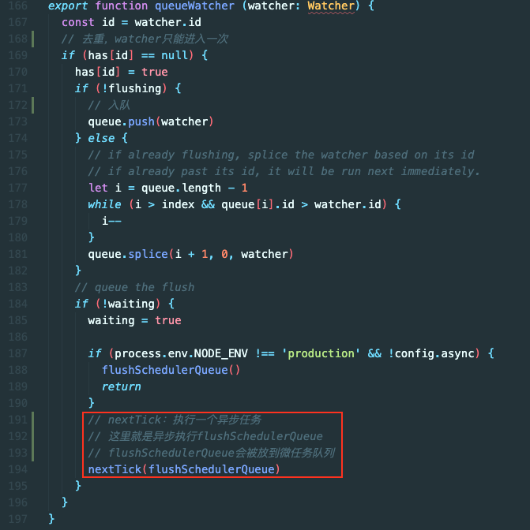

queueWatcher 会对 watcher 进行去重

nextTick：执行一个异步任务

`nextTick(flushSchedulerQueue)`：这里就是异步执行 flushSchedulerQueue(刷新调度队列)

flushSchedulerQueue 会被放到微任务队列

`src/core/util/next-tick.js`
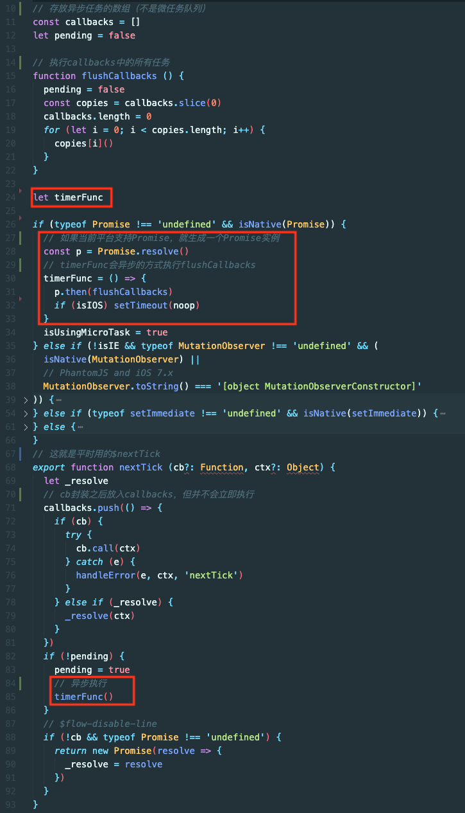

这个`nextTick`方法，就是平时用的$nextTick

`callbacks`是存放异步任务的数组（不是微任务队列），是将来`flushSchedulerQueue`要清空的任务的集合

对 cb 进行了一次封装之后放入`callbacks`，但并不会立即执行

通过`timerFunc()`尝试异步执行

`timerFunc`是一个全局变量，根据当前平台进行判断，选择用何种方式异步执行`flushCallbacks`

`flushCallbacks`执行 callbacks 中的所有任务

流程：

1. nextTick 把 flushSchedulerQueue 放入 callbacks
2. timerFunc() 用异步的方式执行 flushCallbacks()
3. flushCallbacks 执行了 flushSchedulerQueue
4. flushSchedulerQueue 清空存放所有 watcher 的 queue

为什么要这么做？因为 callbacks 里面执行了很多组件的更新

`src/core/observer/scheduler.js`
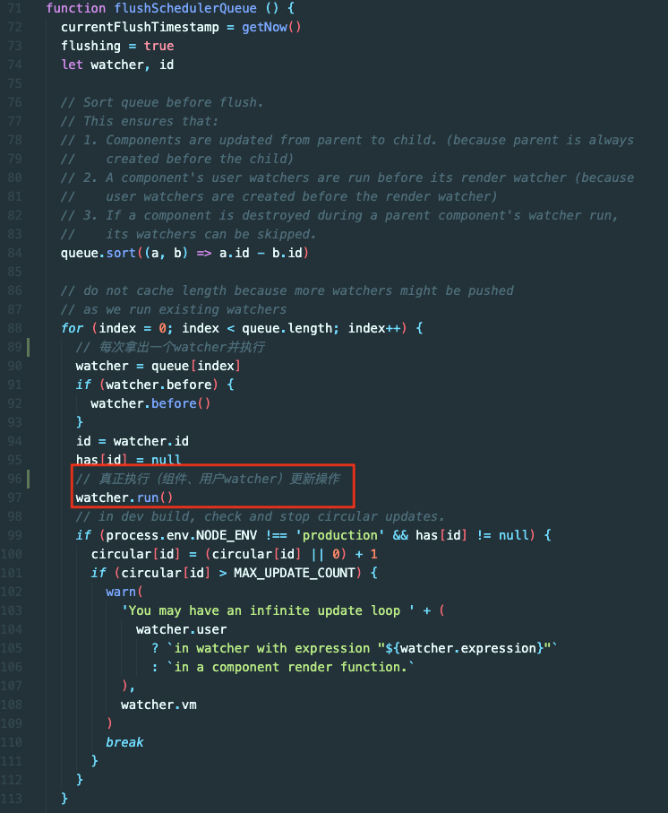

flushSchedulerQueue 对 queue 排序后遍历执行 watcher

真正执行(render watcher、 user watcher)更新操作的是`watcher.run()`

`src/core/observer/watcher.js`
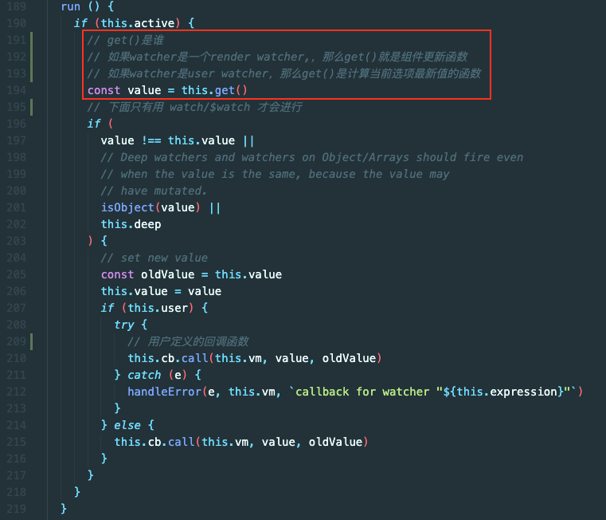

如果当前组件处于激活状态，就执行`get()`

如果 watcher 是一个 render watcher,，那么`get()`就是组件更新函数

如果 watcher 是 user watcher，那么`get()`是计算当前选项最新值的函数

下面的`if(value !== this.value || isObject(value) || this.deep)`只有 user watcher（watch、$watch）才会执行

`this.cb.call`是用户定义的回调函数

如果是 render watcher，只走到`get()`

`src/core/observer/watcher.js`
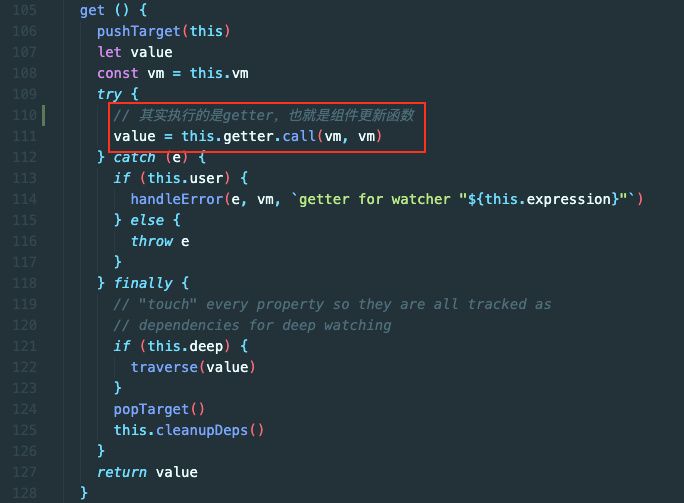

`get()`其实执行的是 getter，也就是组件更新函数

`src/core/observer/watcher.js`
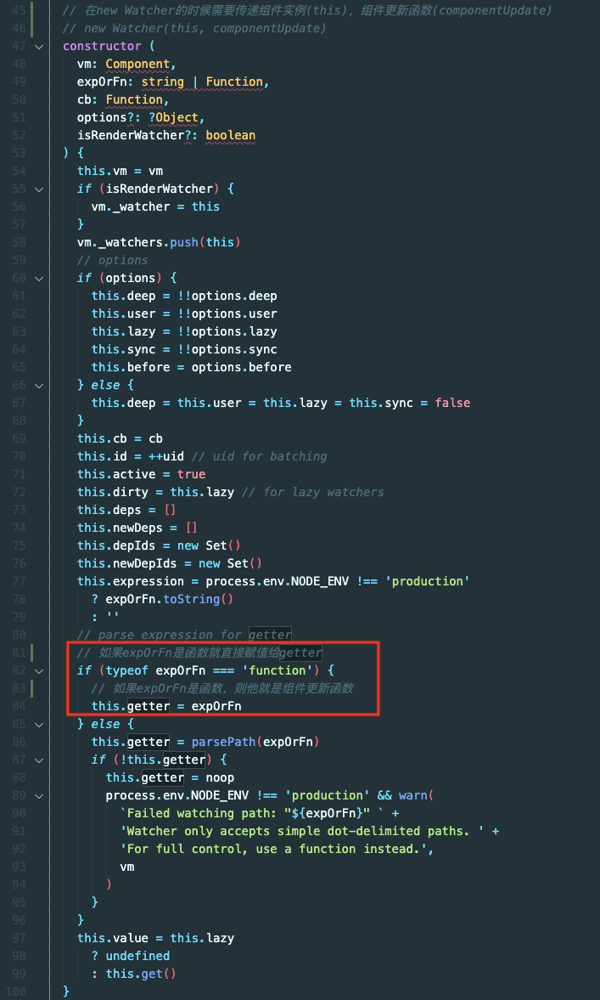

`new Watcher(this, updateComponent)`
在`new Watcher`的时候需要传递组件实例(this)，组件更新函数(updateComponent)

如果 expOrFn 是函数就直接赋值给 getter，则他就是组件更新函数

Watcher 是什么时候建的？

`src/platforms/web/runtime/index.js`
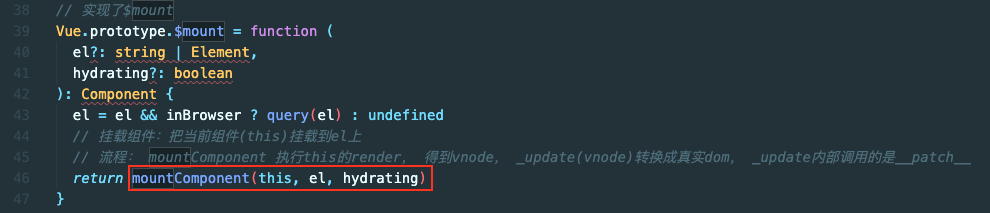

在`$mount`中执行了`mountComponent`

`src/core/instance/lifecycle.js`
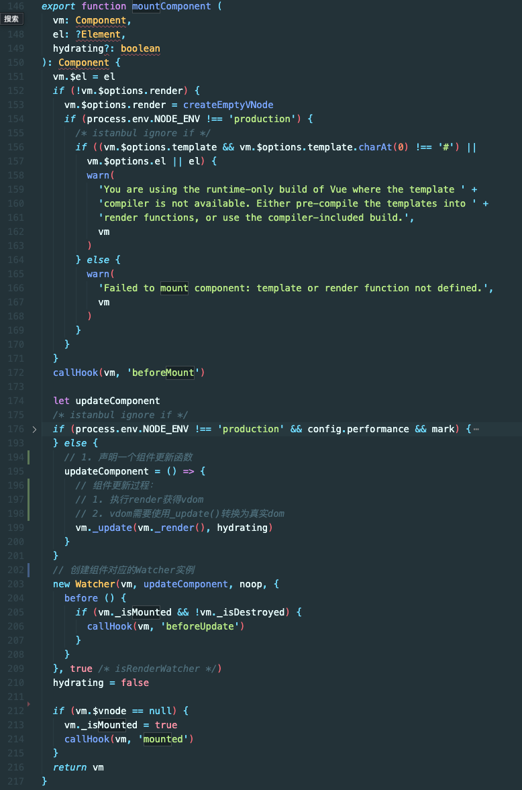

挂载的时候只做两件事

1. 声明一个组件更新函数
2. 创建组件对应的 Watcher 实例

所以 Watcher 是在组件挂载的时候创建的

#### 组件更新流程：

1. 当组件内有一个数据发生变化的时候，会通知更新
2. 通知更新之后。组件会被放到队列
3. 放到队列后，会把刷新队列的任务以异步的方式执行
4. 等到未来的某个时刻刷新队列
5. 刷新队列的时候 watcher 真正执行的函数是 run()
6. run()真正执行的是 getter
7. getter 其实就是 updateComponent

当组件内数据发生变化后，未来的某个时刻，updateComponent 会重新执行以下

组件是怎么更新的？

1. 执行 render 获得虚拟 dom
2. vdom 需要使用`_update()`转换为真实 dom

`src/core/instance/lifecycle.js`
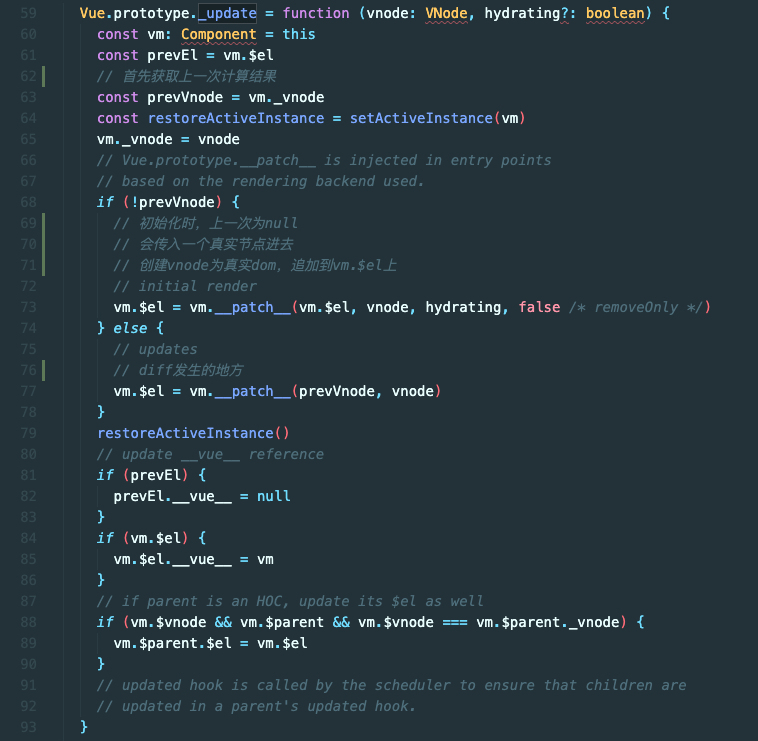

`_update`中判断是否是初始化，初始化的话就创建 vnode 为真实 dom,追加到 vm.$el 上，不是初始化的话就 diff

`examples/test/03-timerFunc.html`

```html
<div id="demo">
  <h1>异步更新</h1>
  <p id="p1">{{foo}}</p>
</div>
<script>
  // 创建实例
  const app = new Vue({
    el: '#demo',
    data: {
      foo: 'ready~~',
    },
    mounted() {
      this.foo = 1
      console.log('1:' + this.foo)
      this.foo = 2
      console.log('2:' + this.foo)
      this.foo = 3
      console.log('3:' + this.foo)
      console.log('p1.innerHTML:' + p1.innerHTML)
      this.$nextTick(() => {
        console.log('p1.innerHTML:' + p1.innerHTML)
      })
    },
  })
</script>
```

问： 此时 2 次 p1.innerHTML 的值是？
答：`ready~~，3`

```html
<div id="demo">
  <h1>异步更新</h1>
  <p id="p1">{{foo}}</p>
</div>
<script>
  // 创建实例
  const app = new Vue({
    el: '#demo',
    data: {
      foo: 'ready~~',
    },
    mounted() {
      this.foo = 1
      console.log('1:' + this.foo)
      this.$nextTick(() => {
        console.log('p1.innerHTML:' + p1.innerHTML)
      })
      this.foo = 2
      console.log('2:' + this.foo)
      this.foo = 3
      console.log('3:' + this.foo)
      console.log('p1.innerHTML:' + p1.innerHTML)
    },
  })
</script>
```

问： 此时 2 次 p1.innerHTML 的值是？
答：`ready~~，3`

```html
<div id="demo">
  <h1>异步更新</h1>
  <p id="p1">{{foo}}</p>
</div>
<script>
  // 创建实例
  const app = new Vue({
    el: '#demo',
    data: {
      foo: 'ready~~',
    },
    mounted() {
      this.$nextTick(() => {
        console.log('p1.innerHTML:' + p1.innerHTML)
      })
      this.foo = 1
      console.log('1:' + this.foo)
      this.foo = 2
      console.log('2:' + this.foo)
      this.foo = 3
      console.log('3:' + this.foo)
      console.log('p1.innerHTML:' + p1.innerHTML)
    },
  })
</script>
```

问： 此时 2 次 p1.innerHTML 的值是？
答：`ready~~，ready~~`

原因：
$nextTick 会让 callbacks 数组中存放回调函数
`this.foo = 1`会在 callbacks 中添加`flusScheduleQueue`
前两种情况，foo 已经入队了，callbacks 队列类似`[flusScheduleQueue, nextTick.cb]`这样子
第三种情况时，foo 入队在 nextTick 后面，callbacks 中类似`[nextTick.cb, flusScheduleQueue]`

```html
<div id="demo">
  <h1>异步更新</h1>
  <p id="p1">{{foo}}</p>
</div>
<script>
  // 创建实例
  const app = new Vue({
    el: '#demo',
    data: {
      foo: 'ready~~',
    },
    mounted() {
      this.foo = 1
      console.log('1:' + this.foo)
      this.foo = 2
      console.log('2:' + this.foo)
      this.foo = 3
      console.log('3:' + this.foo)
      console.log('p1.innerHTML:' + p1.innerHTML)
      Promise.resolve().then(() => {
        console.log('Promise p1.innerHTML:' + p1.innerHTML)
      })
      this.$nextTick(() => {
        console.log('nextTick p1.innerHTML:' + p1.innerHTML)
      })
    },
  })
</script>
```

问：Promise 和 nextTick 谁先输出？
答：`nextTick`

原因：
`this.foo = 1`导致在 callbacks 中添加一个`flusScheduleQueue`，并将 callbacks 添加到微任务队列
Promise 执行时，将回调函数进入微任务队列
nextTick 执行时将回调函数进入 callbacks，此时 callbacks 类似`[flusScheduleQueue, nextTick.cb]`
此时因为上面的微任务队列中是`[callbacks, Promise.then]`的样子
所以在执行 callbacks 时，会将 nextTick 一并执行后再执行 Promise.then

### 虚拟 DOM

**虚拟 DOM（Virtual DOM）是对 DOM 的 JS 抽象表示，它们是 JS 对象，能够描述 DOM 结构和关系。应用的各种状态变化会作用于虚拟 DOM，最终映射到 DOM 上。**

vue 中虚拟 dom 基于 `snabbdom` 实现，安装 snabbdom 并体验

```html
<!DOCTYPE html>
<html lang="en">
  <head></head>
  <body>
    <div id="app"></div>
    <!--安装并引入snabbdom-->
    <script src="https://cdn.bootcdn.net/ajax/libs/snabbdom/0.7.4/snabbdom.min.js"></script>
    <script>
      // 之前编写的响应式函数
      function defineReactive(obj, key, val) {
        Object.defineProperty(obj, key, {
          get() {
            return val
          },
          set(newVal) {
            val = newVal
            // 通知更新
            update()
          },
        })
      }
      // 导入patch的工厂init，h是产生vnode的工厂
      const { init, h } = snabbdom
      // 获取patch函数
      const patch = init([])
      // 上次vnode，由patch()返回
      let vnode
      // 更新函数，将数据操作转换为dom操作，返回新vnode
      function update() {
        if (!vnode) {
          // 初始化，没有上次vnode，传入宿主元素和vnode
          vnode = patch(app, render())
        } else {
          // 更新，传入新旧vnode对比并做更新
          vnode = patch(vnode, render())
        }
      }
      // 渲染函数，返回vnode描述dom结构
      function render() {
        return h('div', obj.foo)
      }
      // 数据
      const obj = {}
      // 定义响应式
      defineReactive(obj, 'foo', '')
      // 赋一个日期作为初始值
      obj.foo = new Date().toLocaleTimeString()
      // 定时改变数据，更新函数会重新执行
      setInterval(() => {
        obj.foo = new Date().toLocaleTimeString()
      }, 1000)
    </script>
  </body>
</html>
```

### DIFF

从`_update`看起

`src/core/instance/lifecycle.js`

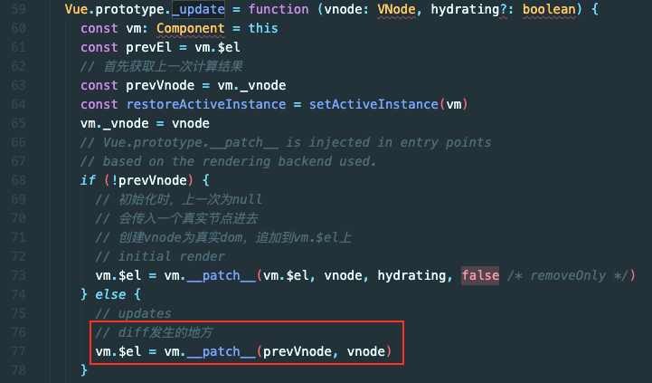

`__patch__`从何而来？

`src/platforms/web/runtime/index.js`

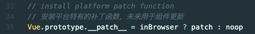

`__patch`是在平台特有代码中指定的

`src/core/vdom/patch.js`

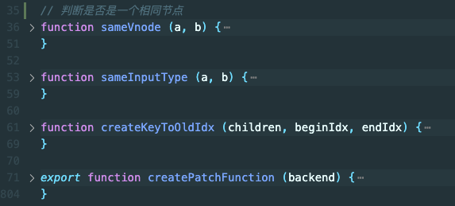

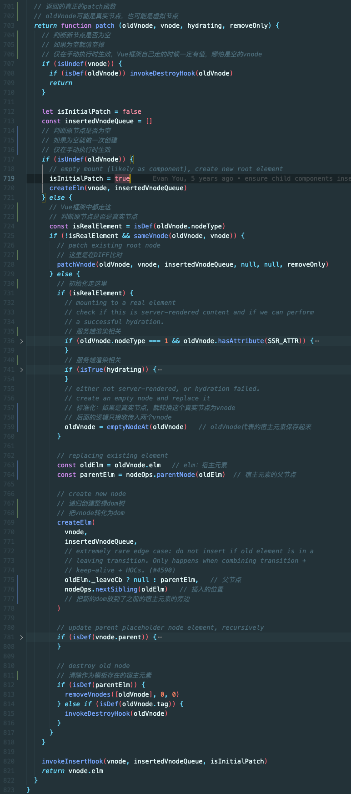

**diff 原则：深度优先，同层比较(为了降低时间复杂度)**

比较两个 VNode，包括三种类型操作：_属性更新_、_文本更新_、_子节点更新_

具体规则如下：

1. 新老节点均有 children 子节点，则对子节点进行 diff 操作，调用 updateChildren
2. 如果新节点有子节点而老节点没有子节点，先清空老节点的文本内容，然后为其新增子节点。
3. 当新节点没有子节点而老节点有子节点的时候，则移除该节点的所有子节点。
4. 当新老节点都无子节点的时候，只是文本的替换。

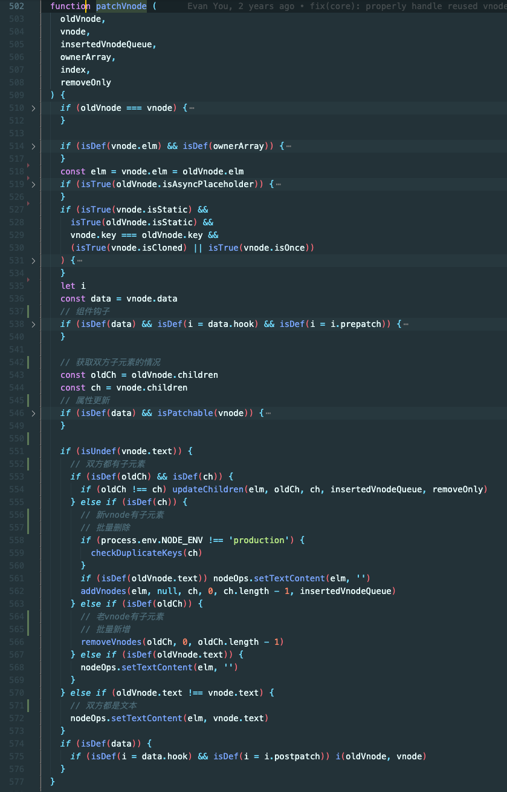

#### updateChildren 算法：

1. 新老 vnode 各创建一个首尾标记，向内双循环，直到`oldStartIdx <= oldEndIdx && newStartIdx <= newEndIdx`
2. oldStartVnode 和 newStartVnodel 满足 sameVnode，就直接 patchVnode
3. oldStartVnode 和 newEndVnode 满足 sameVnode， patchVnode 同时将真实 dom 移到 oldEndVnode 后面
4. oldEndVnode 和 newStartVnode 满足 sameVnode，patchVnode 同时将真实 dom 移到 oldStartVnode 前面
5. 如果都不满足，就在 oldVnode 中找和 newStartVnode 相同的节点，如果存在就 patchVnode 把真实 dom 添加到 oldStartIndex 前面
6. 如果在 oldVnode 中找不到和 newStartVnode 相同的节点，就 调用 createElm，patchVnode 到 oldStartIndex 前面
7. 如果 oldVnode 先遍历完，说明新的比老的多，就把剩下的 newVnode 插入真实 dom
8. 如果 newVnode 先遍历完，说明老的比新的多，就把剩下的 oldVnode 对应的真实 dom 删除

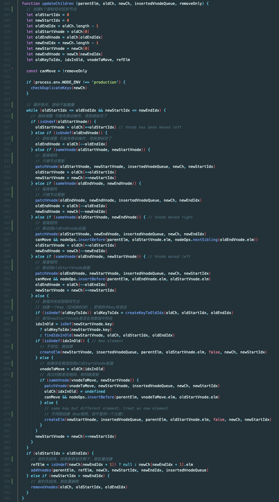

#### key 的作用：

先看`sameVnode`方法

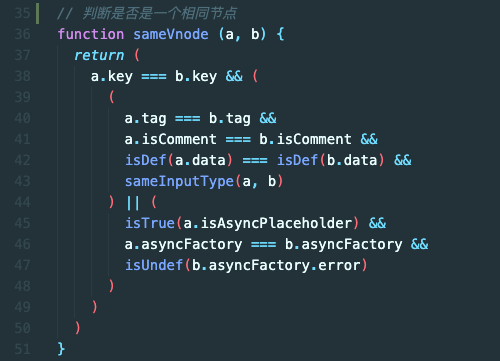

sameVnode 通过判断 tag（div、span……），注释，data，input 判断 type 等来判断是否相同

当不设置 key 的时候，key 就是`undefined`，`undefined === undefined`，在列表操作时，就会进行强制更新

例：数组`[1,2,3]`在 2 前面添加 4
有 key 时，`[1,2,3][1,4,2,3] => [2,3][4,2,3] => [2][4,2] => [][4]` 最后创建 4
无 key 时，`[1,2,3][1,4,2,3] => [2,3][4,2,3] => [3][2,3] => [][3]` 全都强制更新一遍，最后创建 3

所以平常使用时要加 key，且 key 要保持唯一，且不要用索引，不然会导致强制更新

#### patch 函数是怎么获取的？

`src/platforms/web/runtime/index.js`

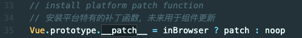

传递平台特有的节点操作选项给工厂函数，返回 patch

这里 nodeOps 就是是 web 平台特有的 dom 操作

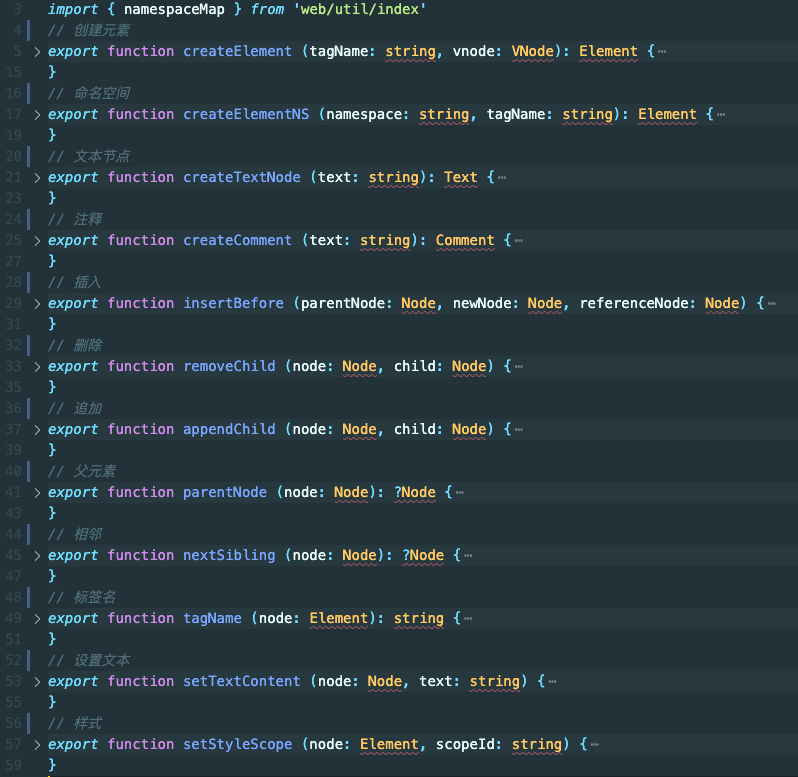

modules 是把平台 modules 和 baseModules 做了一个拼接

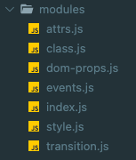

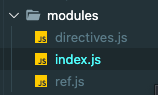

平台属性相关的操作会以 module 的形式暴露，都会有钩子函数的名字，最终 patch 里执行的时候调用这个钩子对应的方法

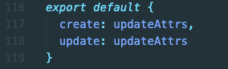

#### 节点属性如何更新？

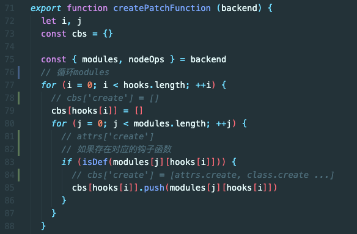

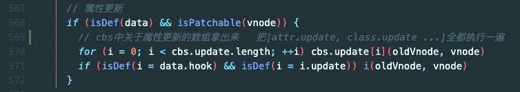

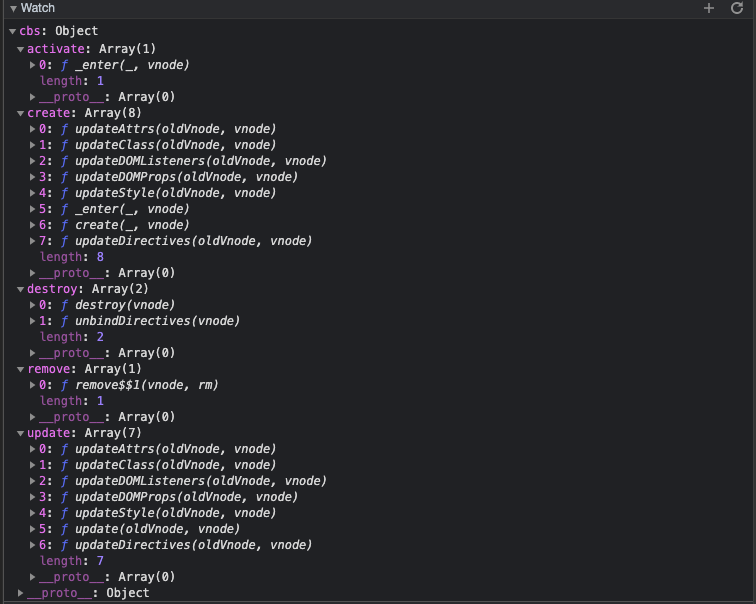

### 思维导图

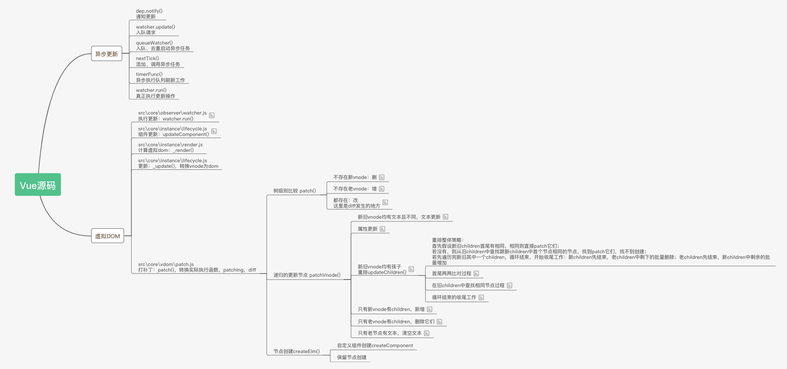

**全文完**
