目录：

- [Vue2 源码解析](https://yongmaple.com/2021/05/26/Vue3源码解析/)
- [Vue2 源码解析二](https://yongmaple.com/2021/05/31/Vue3源码解析二/)
- [Vue2 源码解析三](https://yongmaple.com/2021/05/31/Vue3源码解析三/)

本文项目地址：[https://github.com/YongMaple/vue-next](https://github.com/YongMaple/vue-next)

### Vue3 初体验

```html
<div id="app">
  <h3>{{title}}</h3>
  <h3>{{state.title}}</h3>
  <comp></comp>
</div>

<script src="http://unpkg.com/vue@next"></script>
<script>
  const { createApp, reactive } = Vue
  // new Vue
  // 函数式：类型支持会好（ts），摇树优化（打包体积减小）
  // 消灭静态方法（Vue.component...），变成实例方法  例如component如果没用，就不会被打包进去
  // 以前在Vue.prototype里面做配置，会污染全局构造函数，现在可以创建多个实例不会互相污染，实例之间相互独立
  // const app2 = createApp({})
  // 全局配置可以通过app.config.globalProperties.XXX来实现
  const app = createApp({
    // 统一api，一致性
    data() {
      return {
        title: 'hello, vue3!',
      }
    },
    setup() {
      const state = reactive({
        title: 'vue3, hello',
      })
      return {
        state,
      }
    },
  })
  // 全局组件
  app.component('comp', {
    template: '<div>comp</div>',
  })
  // api简化、一致性更强
  app.mount('#app')
</script>
```

- 动机

1. 类型⽀持更好
2. 利于 tree-shaking
3. API 简化、⼀致性：render 函数，sync 修饰符，指令定义等
4. 复⽤性：composition api
5. 性能优化：响应式、编译优化
6. 扩展性：⾃定义渲染器

### 手写 Vue3

```html
<div id="app">
  <h3>{{title}}</h3>
</div>

<script>
  // 基本结构
  const Vue = {
    createApp(options) {
      // 返回app实例
      return {
        mount(selector) {
          // 宿主
          const parent = document.querySelector(selector)
          // 获取渲染函数，编译结果
          if (!options.render) {
            options.render = this.compile(parent.innerHTML)
          }
          // 渲染dom，追加到宿主元素
          console.log(options.render)
          const el = options.render.call(options.data())
          // Vue2中是先追加再删除原来的，Vue3直接清空再追加
          parent.innerHTML = ''
          parent.appendChild(el)
        },
        compile(template) {
          // 返回render
          return function render() {
            // 描述视图
            // 跳过对template的解析，这里直接写死
            const h3 = document.createElement('h3')
            h3.textContent = this.title
            return h3
          }
        },
      }
    },
  }
</script>
<script>
  const { createApp } = Vue
  const app = createApp({
    data() {
      return {
        title: 'hello, vue3!',
      }
    },
  })
  app.mount('#app')
</script>
```

#### 兼容 Composition API

```html
<div id="app">
  <h3>{{title}}</h3>
</div>

<script>
  // 基本结构
  const Vue = {
    createApp(options) {
      // 返回app实例
      return {
        mount(selector) {
          // 宿主
          const parent = document.querySelector(selector)
          // 获取渲染函数，编译结果
          if (!options.render) {
            options.render = this.compile(parent.innerHTML)
          }

          if (options.setup) {
            this.setupState = options.setup()
          }
          this.data = options.data()

          this.proxy = new Proxy(this, {
            // 代理目标(是在data还是setup里)和访问的key
            // target指的是app
            get(target, key) {
              if (key in target.setupState) {
                return target.setupState[key]
              } else {
                return target.data[key]
              }
            },
            set(target, key, val) {
              if (key in target.setupState) {
                target.setupState[key] = val
              } else {
                target.data[key] = val
              }
            },
          })

          // 渲染dom，追加到宿主元素
          const el = options.render.call(this.proxy)
          // Vue2中是先追加再删除原来的，Vue3直接清空再追加
          parent.innerHTML = ''
          parent.appendChild(el)
        },
        compile(template) {
          // 返回render
          return function render() {
            // 描述视图
            // 跳过对template的解析，这里直接写死
            const h3 = document.createElement('h3')
            h3.textContent = this.title
            return h3
          }
        },
      }
    },
  }
</script>
<script>
  const { createApp } = Vue
  const app = createApp({
    data() {
      return {
        title: 'hello, vue3!',
      }
    },
    setup() {
      return {
        title: 'vue3, hello!',
      }
    },
  })
  app.mount('#app')
</script>
```

#### 提高扩展性，兼容各平台

```html
<div id="app">
  <h3>{{title}}</h3>
</div>

<script>
  // 基本结构
  const Vue = {
    createApp(options) {
      const renderer = Vue.createRenderer({
        querySelector(selector) {
          return document.querySelector(selector)
        },
        insert(child, parent, anchor) {
          parent.insertBefore(child, anchor || null)
        },
      })
      return renderer.createApp(options)
    },
    createRenderer({ querySelector, insert }) {
      // 平台特有的操作
      // 获得渲染器
      return {
        createApp(options) {
          return {
            mount(selector) {
              // 宿主
              const parent = querySelector(selector)
              // 获取渲染函数，编译结果
              if (!options.render) {
                options.render = this.compile(parent.innerHTML)
              }

              if (options.setup) {
                this.setupState = options.setup()
              }
              this.data = options.data()

              this.proxy = new Proxy(this, {
                // 代理目标(是在data还是setup里)和访问的key
                // target指的是app
                get(target, key) {
                  if (key in target.setupState) {
                    return target.setupState[key]
                  } else {
                    return target.data[key]
                  }
                },
                set(target, key, val) {
                  if (key in target.setupState) {
                    target.setupState[key] = val
                  } else {
                    target.data[key] = val
                  }
                },
              })

              // 渲染dom，追加到宿主元素
              const el = options.render.call(this.proxy)
              // Vue2中是先追加再删除原来的，Vue3直接清空再追加
              parent.innerHTML = ''
              insert(el, parent)
            },
            compile(template) {
              // 返回render
              return function render() {
                // 描述视图
                // 跳过对template的解析，这里直接写死
                const h3 = document.createElement('h3')
                h3.textContent = this.title
                return h3
              }
            },
          }
        },
      }
    },
  }
</script>
<script>
  const { createApp } = Vue
  const app = createApp({
    data() {
      return {
        title: 'hello, vue3!',
      }
    },
    setup() {
      return {
        title: 'vue3, hello!',
      }
    },
  })
  app.mount('#app')
</script>
```

### 源码学习

- 版本：3.1.0-beta.4
- 添加 sourcemap，`"dev": "node scripts/dev.js --sourcemap",`
- 安装依赖：`yarn --ignore-scripts`
- 编译：`yarn dev`，编译完会在`packages/vue/dist`中
- 调试范例代码：`yarn serve`

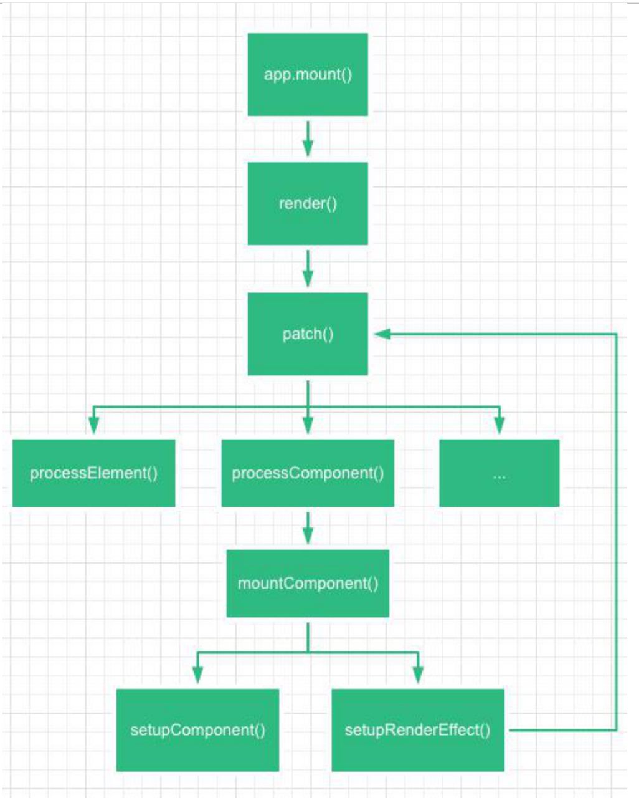

源码路径：`packages/runtime-dom/src/index.ts`

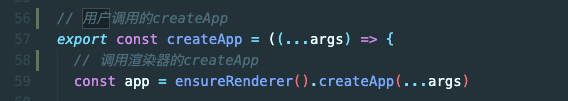

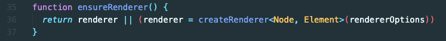

源码路径：`packages/runtime-core/src/renderer.ts` _核心代码几乎都在这_

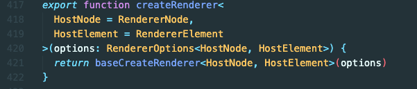

`baseCreateRenderer`函数有 2000 行代码……

最后和上面手写的一样，返回了渲染器，不过这更加完善

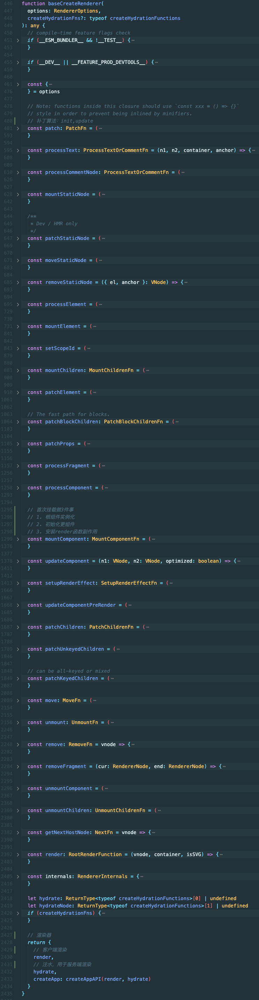

源码路径：`packages/runtime-core/src/apiCreateApp.ts`

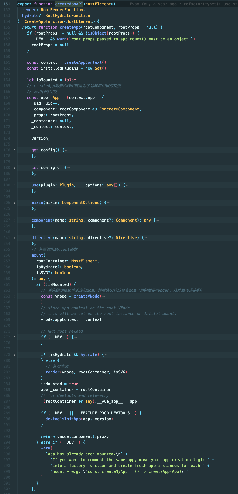

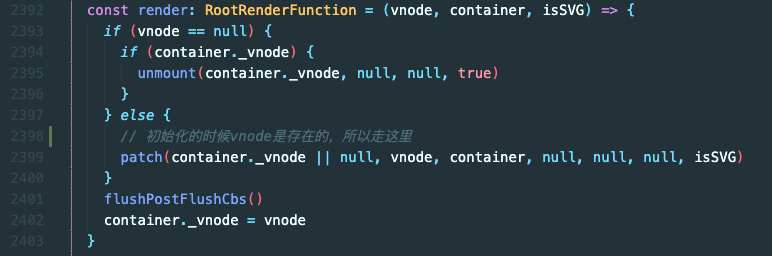

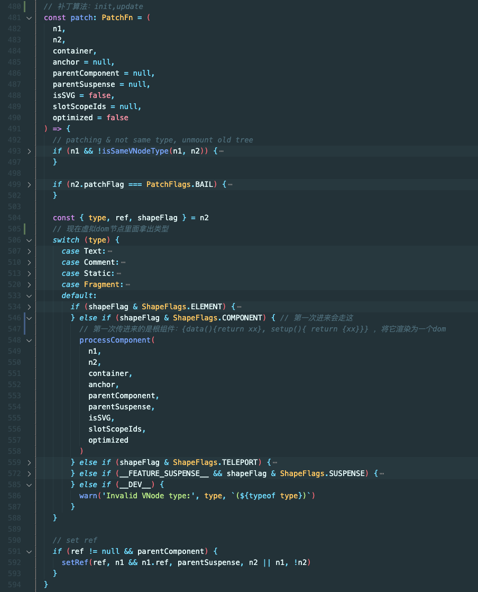

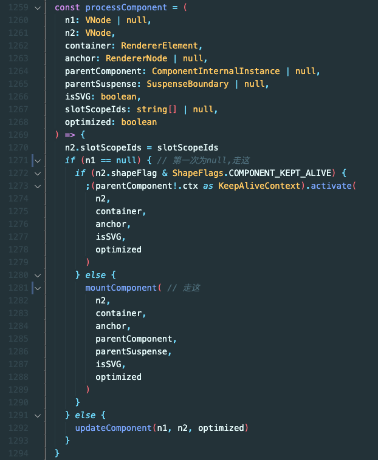

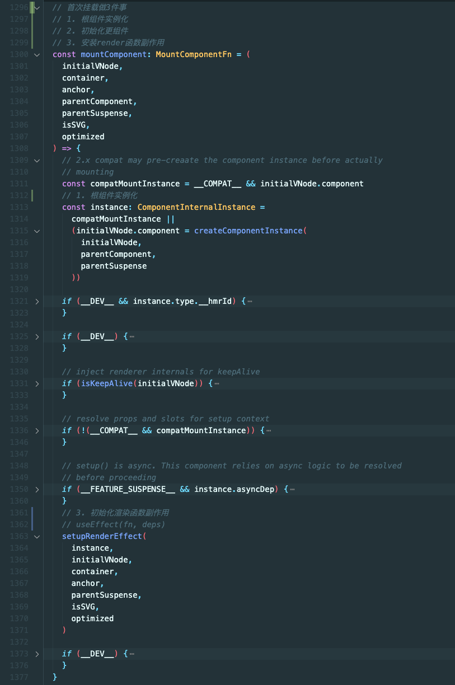

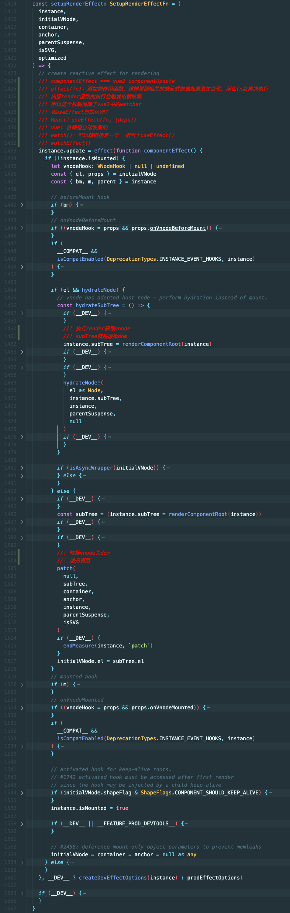
