目录：

- [Vue2 源码解析](https://yongmaple.com/2021/05/26/Vue3源码解析/)
- [Vue2 源码解析二](https://yongmaple.com/2021/05/31/Vue3源码解析二/)
- [Vue2 源码解析三](https://yongmaple.com/2021/05/31/Vue3源码解析三/)

本文项目地址：[https://github.com/YongMaple/vue-next](https://github.com/YongMaple/vue-next)

### 体验 compositionAPI

```html
<div id="app">
  <h3>{{title}}</h3>
  <!-- <h3>{{state.title}}</h3> -->
  <p>{{foo}}</p>
  <!-- 模板中自动解包 -->
  <h3>{{title2}}</h3>
</div>
<script src="http://unpkg.com/vue@next"></script>
<script>
  const { createApp, reactive, ref, toRefs } = Vue
  const app = createApp({
    setup() {
      // 对象响应式
      const state = reactive({
        title: 'vue3, hello',
        // props
        foo: 'foooooo',
      })
      setTimeout(() => {
        state.title = 'vue3, hello!!!!!'
      }, 1000)
      // 单值响应
      // ref => Ref 包装类型
      const title2 = ref('hello, vue3')
      setTimeout(() => {
        title2.value = 'hello, vue3!!!!!!'
      }, 1000)
      return {
        ...toRefs(state),
        title2,
      }
    },
  })
  app.mount('#app')
</script>
```

reactive 和 ref 两种方式中，相对更加推荐 ref

```html
<div id="app">
  <h3>{{title}}</h3>
  <!-- <h3>{{state.title}}</h3> -->
  <p>{{foo}}</p>
  <p @click="add">{{count}}</p>
  <p>{{double}}</p>
  <!-- 模板中自动解包 -->
  <h3>{{title2}}</h3>
</div>
<script src="http://unpkg.com/vue@next"></script>
<script>
  const { createApp, reactive, ref, toRefs, computed, onMounted } = Vue

  function useState() {
    // 对象响应式
    const state = reactive({
      title: 'vue3, hello',
      // props
      foo: 'foooooo',
      count: 1,
    })

    setTimeout(() => {
      state.title = 'vue3, hello!!!!!'
    }, 3000)

    onMounted(() => {
      state.foo = 'foo'
    })
    // 计算属性
    const double = computed(() => {
      return state.count * 2
    })

    function add() {
      state.count++
    }
    return {
      state,
      double,
      add,
    }
  }
  const app = createApp({
    setup() {
      const { state, double, add } = useState()

      // 单值响应
      // ref => Ref 包装类型
      const title2 = ref('hello, vue3')
      setTimeout(() => {
        title2.value = 'hello, vue3!!!!!!'
      }, 3000)

      onMounted(() => {
        title2.value = 'lalalaalal'
      })

      return {
        ...toRefs(state),
        title2,
        double,
        add,
      }
    },
  })
  app.mount('#app')
</script>
```

下面是官方例子：

```html
<meta charset="UTF-8" />
<script src="../dist/vue.global.js"></script>
<div id="app">
  <h1>logic reuse</h1>
</div>
<script>
  const { createApp, reactive, onMounted, onUnmounted, toRefs } = Vue
  // ⿏标位置侦听
  function useMouse() {
    // 数据响应化
    const state = reactive({
      x: 0,
      y: 0,
    })
    const update = (e) => {
      state.x = e.pageX
      state.y = e.pageY
    }
    onMounted(() => {
      window.addEventListener('mousemove', update)
    })
    onUnmounted(() => {
      window.removeEventListener('mousemove', update)
    })
    // 转换所有key为响应式数据
    return toRefs(state)
  }
  // 事件监测
  function useTime() {
    const state = reactive({
      time: new Date(),
    })
    onMounted(() => {
      setInterval(() => {
        state.time = new Date()
      }, 1000)
    })
    return toRefs(state)
  }
  // 逻辑组合
  const MyComp = {
    template: `
 <div>x: {{ x }} y: {{ y }}</div>
 <p>time: {{time}}</p>
 `,
    setup() {
      // 使⽤⿏标逻辑
      const { x, y } = useMouse()
      // 使⽤时间逻辑
      const { time } = useTime()
      // 返回使⽤
      return {
        x,
        y,
        time,
      }
    },
  }
  createApp(MyComp).mount('#app')
</script>
```

对⽐ mixins，好处显⽽易⻅：

- x,y,time 来源清晰
- 不会与 data、props 等命名冲突
- 更好的维护性

### 响应式原理

#### Vue2 的方式

Object.defineProperty()

```js
// 拦截每个key，从⽽可以侦测数据变化
function defineReactive(obj, key, val) {
  Object.defineProperty(obj, key, {
    get() {
      return val
    },
    set(v) {
      val = v
      update()
    },
  })
}
function update() {
  console.log(obj.foo)
}
const obj = {}
defineReactive(obj, 'foo', 'foo')
obj.foo = 'foooooooo'
```

#### Vue3 的方式

Proxy

```js
// 代理整个对象，从⽽侦测数据变化
function defineReactive(obj) {
  return new Proxy(obj, {
    get(target, key) {
      return target[key]
    },
    set(target, key, val) {
      target[key] = val
      update()
    },
  })
}
function update() {
  console.log(obj.foo)
}
const obj = {}
const observed = defineReactive(obj)
observed.foo = 'foooooooo'
```

#### Vue2 vs Vue3

1. vue2 中需要递归遍历对象所有 key，速度慢

```js
// 1.对象响应化：遍历每个key，定义getter、setter
function observe(obj) {
  if (typeof obj !== 'object' || obj == null) {
    return
  }
  const keys = Object.keys(obj)
  for (let i = 0; i < keys.length; i++) {
    const key = keys[i]
    defineReactive(obj, key, obj[key])
  }
}
function defineReactive(obj, key, val) {
  observe(val)

  Object.defineProperty(obj, key, {
    get() {
      return val
    },
    set(newVal) {
      if (newVal !== val) {
        observe(newVal)
        val = newVal
        dep.notify()
      }
    },
  })
}
```

2. 数组响应式需要额外实现

```js
// 数组响应化：覆盖数组原型⽅法，额外增加通知逻辑
const originalProto = Array.prototype
const arrayProto = Object.create(originalProto)
;['push', 'pop', 'shift', 'unshift', 'splice', 'reverse', 'sort'].forEach(
  (method) => {
    arrayProto[method] = function () {
      originalProto[method].apply(this, arguments)
      dep.notify()
    }
  }
)
```

3. 新增或删除属性⽆法监听，需要使⽤特殊 api

```js
Vue.set(obj, 'foo', 'bar')
Vue.delete(obj, 'foo')
```

4. 不⽀持 Map、Set、Class 等数据结构

##### vue3 实现

vue3 中利⽤ es6 proxy 实现数据响应式，很好的解决了以上问题。

```js
function reactive(obj) {
  if (typeof obj !== 'object' && obj != null) {
    return obj
  }
  // Proxy相当于在对象外层加拦截
  // http://es6.ruanyifeng.com/#docs/proxy
  const observed = new Proxy(obj, {
    get(target, key, receiver) {
      // Reflect⽤于执⾏对象默认操作，更规范、更友好
      // Proxy和Object的⽅法Reflect都有对应
      // http://es6.ruanyifeng.com/#docs/reflect
      const res = Reflect.get(target, key, receiver)
      console.log(`获取${key}:${res}`)
      return res
    },
    set(target, key, value, receiver) {
      const res = Reflect.set(target, key, value, receiver)
      console.log(`设置${key}:${value}`)
      return res
    },
    deleteProperty(target, key) {
      const res = Reflect.deleteProperty(target, key)
      console.log(`删除${key}:${res}`)
      return res
    },
  })
  return observed
}
// 测试
const state = reactive({ foo: 'foo' })
// 获取
state.foo // ok
// 设置已存在属性
state.foo = 'fooooooo' // ok
// 设置不存在属性
state.dong = 'dong' // ok
// 删除属性
delete state.dong // ok
```

so，当面试官问你。vue2vue3 有什么变化？可以这样回答：

在数据响应式这块革命性的更新

1. 初始化速度很快，不需要在一开始就递归遍历所有 key
2. 维护依赖关系变得更加简单，资源占用会少
3. 不需要对数组有额外的实现，不需要产生 vue.set 和 vue.delete 这样额外的 api
4. 对数据类型的支持更广了
5. 缺点：兼容性很差，连 IE11 都不兼容了，想要兼容就用 vue2.7，vue3 永不支持。vue2.7 是自带 compositionApi 的 Vue2

### 造个轮子

```js
function reactive(obj) {
  return new Proxy(obj, {
    get(target, key) {
      console.log('get', key)
      return target[key]
    },
    set(target, key, val) {
      console.log('set', key)
      target[key] = val
    },
    deleteProperty(target, key) {
      console.log('delete prop', key)
      delete target[key]
    },
  })
}

const state = reactive({
  foo: 'foo',
})
state.foo
state.foo = 'fooooo'
delete state.foo
```

以上是最底层的实现

源码中还多了一层，用反射去写

```js
function reactive(obj) {
  return new Proxy(obj, {
    get(target, key) {
      console.log('get', key)
      // 1. 更加健壮，在此期间有什么异常，可以更好的捕获
      // 2. 一定会返回一个结果，在这里return出去
      // 既健壮又明确
      const res = Reflect.get(target, key)
      return res
    },
    set(target, key, val) {
      console.log('set', key)
      const res = Reflect.set(target, key, val)
      // 这里有个布尔值可以返回出去了，知道最终操作的结果了
      return res
    },
    deleteProperty(target, key) {
      console.log('delete prop', key)
      const res = Reflect.deleteProperty(target, key)
      return res
    },
  })
}

const state = reactive({
  foo: 'foo',
})
state.foo
state.foo = 'fooooo'
delete state.foo
```

上面没有对嵌套对象做处理，下面加上递归，这里使用懒处理，在使用时再去递归

```js
const isObject = (v) => typeof v === 'object' && v !== null

function reactive(obj) {
  return new Proxy(obj, {
    get(target, key) {
      console.log('get', key)
      // 1. 更加健壮，在此期间有什么异常，可以更好的捕获
      // 2. 一定会返回一个结果，在这里return出去
      // 既健壮又明确
      const res = Reflect.get(target, key)
      // 懒处理
      return isObject(res) ? reactive(res) : res
    },
    set(target, key, val) {
      console.log('set', key)
      const res = Reflect.set(target, key, val)
      // 这里有个布尔值可以返回出去了，知道最终操作的结果了
      return res
    },
    deleteProperty(target, key) {
      console.log('delete prop', key)
      const res = Reflect.deleteProperty(target, key)
      return res
    },
  })
}

const state = reactive({
  foo: 'foo',
  bar: {
    baz: 1,
  },
})
state.foo
state.foo = 'fooooo'
delete state.foo
state.bar.baz
```

改造一下[上文](https://yongmaple.com/2021/05/26/Vue3源码解析/)中的例子

```html
<div id="app">
  <h3>{{title}}</h3>
</div>

<script>
  const isObject = (v) => typeof v === 'object' && v !== null

  function reactive(obj) {
    return new Proxy(obj, {
      get(target, key) {
        console.log('get', key)
        // 1. 更加健壮，在此期间有什么异常，可以更好的捕获
        // 2. 一定会返回一个结果，在这里return出去
        // 既健壮又明确
        const res = Reflect.get(target, key)
        // 懒处理
        return isObject(res) ? reactive(res) : res
      },
      set(target, key, val) {
        console.log('set', key)
        const res = Reflect.set(target, key, val)
        app.update()
        // 这里有个布尔值可以返回出去了，知道最终操作的结果了
        return res
      },
      deleteProperty(target, key) {
        console.log('delete prop', key)
        const res = Reflect.deleteProperty(target, key)
        app.update()
        return res
      },
    })
  }
  // 基本结构
  const Vue = {
    createApp(options) {
      const renderer = Vue.createRenderer({
        querySelector(selector) {
          return document.querySelector(selector)
        },
        insert(child, parent, anchor) {
          parent.insertBefore(child, anchor || null)
        },
      })
      return renderer.createApp(options)
    },
    createRenderer({ querySelector, insert }) {
      // 平台特有的操作
      // 获得渲染器
      return {
        createApp(options) {
          return {
            mount(selector) {
              // 宿主
              const parent = querySelector(selector)
              // 获取渲染函数，编译结果
              if (!options.render) {
                options.render = this.compile(parent.innerHTML)
              }

              if (options.setup) {
                this.setupState = options.setup()
              }
              this.data = options.data()

              this.proxy = new Proxy(this, {
                // 代理目标(是在data还是setup里)和访问的key
                // target指的是app
                get(target, key) {
                  if (key in target.setupState) {
                    return target.setupState[key]
                  } else {
                    return target.data[key]
                  }
                },
                set(target, key, val) {
                  if (key in target.setupState) {
                    target.setupState[key] = val
                  } else {
                    target.data[key] = val
                  }
                },
              })

              // 渲染dom，追加到宿主元素
              this.update = function () {
                const el = options.render.call(this.proxy)
                // Vue2中是先追加再删除原来的，Vue3直接清空再追加
                parent.innerHTML = ''
                insert(el, parent)
              }
              this.update() // init
            },
            compile(template) {
              // 返回render
              return function render() {
                // 描述视图
                // 跳过对template的解析，这里直接写死
                const h3 = document.createElement('h3')
                h3.textContent = this.title
                return h3
              }
            },
          }
        },
      }
    },
  }
</script>
<script>
  const { createApp } = Vue
  const app = createApp({
    data() {
      return {
        title: 'hello, vue3!',
      }
    },
    setup() {
      const state = reactive({
        title: 'vue3, hello!',
      })
      setTimeout(() => {
        state.title = 'hello, hello, vue3'
      }, 2000)
      return state
    },
  })
  app.mount('#app')
</script>
```

目前的实现，对 app 有强耦合，不通用

现在需要创建响应式数据和副作用函数之间依赖关系

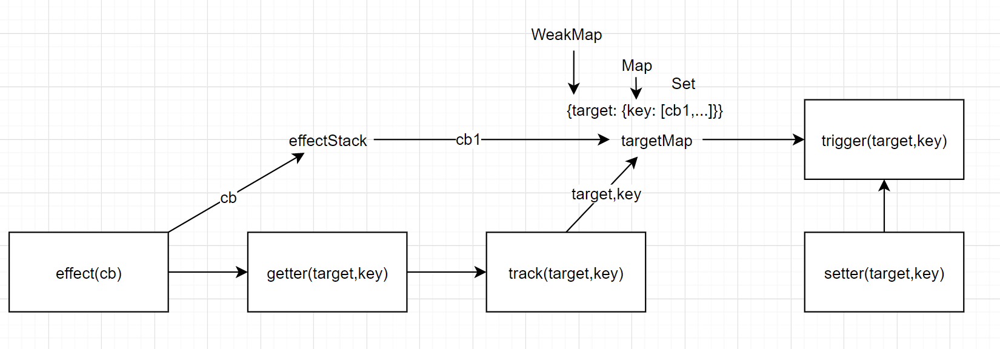

effect 的作用是把 cb 临时储存在变量 effectStack 里，会立刻调一次 cb，调完之后由于它内部有副作用，所以 getter 会触发。我们希望在 getter 的内部有一个依赖收集函数叫 track，track 的作用是把当前传入的响应式对象的 key 和 cb 建立依赖关系。这关系通过创建一个 weakMap 建立，这个 weakMap 可以保存 target 的 key 和 cb 之间的关系。为什么要是一个 weakMap 呢，因为这个 target 是一个对象，它的 key 用 weakMap 来表示是最合适的。它的 value 又是一个 Map。一个依赖数据的副作用可能不止一个，所以 cb 这里是一个 Set.
track 就是订阅，触发之后就发布，触发更新

> WeakMap: 相比于 Map，区别主要在于垃圾回收机制。在 Map 中，当 key = null 时，不会被回收，需要 map.delete(key)才会被回收，而 WeakMap，当 key = null 时，就会被回收。另外的区别就是 WeakMap 只有 get,set,has,delete 方法，没有 keys,values,entries，也没有 size,clear。可以参考这篇[文章](https://segmentfault.com/a/1190000015774465)
> 

```js
const isObject = (v) => typeof v === 'object' && v !== null

function reactive(obj) {
  return new Proxy(obj, {
    get(target, key) {
      console.log('get', key)
      // 1. 更加健壮，在此期间有什么异常，可以更好的捕获
      // 2. 一定会返回一个结果，在这里return出去
      // 既健壮又明确
      const res = Reflect.get(target, key)
      // 依赖收集
      track(target, key)
      // 懒处理
      return isObject(res) ? reactive(res) : res
    },
    set(target, key, val) {
      console.log('set', key)
      const res = Reflect.set(target, key, val)
      trigger(target, key)
      // 这里有个布尔值可以返回出去了，知道最终操作的结果了
      return res
    },
    deleteProperty(target, key) {
      console.log('delete prop', key)
      const res = Reflect.deleteProperty(target, key)
      trigger(target, key)
      return res
    },
  })
}

// 创建响应式数据和副作用函数之间依赖关系

// 临时保存响应式函数（传入的fn）
const effectStack = []

// effect: 添加副作用函数
function effect(fn) {
  // 把传入的fn封装一下
  const eff = function () {
    try {
      // 入栈
      effectStack.push(eff)
      // 执行
      fn()
    } finally {
      // 出栈
      effectStack.pop()
    }
  }
  // 立即执行，激活依赖收集的过程
  eff()

  return eff
}

// 存储依赖关系的map
const targetMap = new WeakMap()

// 依赖收集
function track(target, key) {
  const eff = effectStack[effectStack.length - 1]
  if (eff) {
    // 1. 先获取target对应的map
    let depMap = targetMap.get(target)
    if (!depMap) {
      // 首次访问不存在，则创建
      depMap = new Map()
      targetMap.set(target, depMap)
    }
    // 2. 获取key对应的set
    let deps = depMap.get(key)
    if (!deps) {
      // 首次访问不存在，则创建
      deps = new Set()
      depMap.set(key, deps)
    }
    // 3. 建立target,key和eff之间的关系
    deps.add(eff)
  }
}

// 依赖触发
function trigger(target, key) {
  // 通过target获取map
  const depMap = targetMap.get(target)
  if (depMap) {
    // 通过key获取deps
    const deps = depMap.get(key)

    if (deps) {
      // 执行所有副作用
      deps.forEach((dep) => dep())
    }
  }
}

const state = reactive({
  foo: 'foo',
  bar: {
    baz: 1,
  },
})
// state.foo
// state.foo = 'fooooo'
// delete state.foo
// state.bar.baz
effect(() => {
  console.log('effect1', state.foo)
})
effect(() => {
  console.log('effect2', state.foo, state.bar.baz)
})
state.bar.baz = 'fooooooo'
```

与 React 不用，依赖关系是自动建立的，不需要[]指定

把写完的这个 reactive.js 引入 myvue.html

```html
<div id="app">
  <h3>{{title}}</h3>
</div>
<script src="./reactive.js"></script>
<script>
  // 基本结构
  const Vue = {
    ...
    createRenderer({
      querySelector,
      insert
    }) {
      // 平台特有的操作
      // 获得渲染器
      return {
        createApp(options) {
          return {
            mount(selector) {
              ...
              // 渲染dom，追加到宿主元素
              this.update = effect(() => {
                const el = options.render.call(this.proxy)
                // Vue2中是先追加再删除原来的，Vue3直接清空再追加
                parent.innerHTML = ''
                insert(el, parent)
              })
              // this.update() // init
            },
            ...
          }
        },
      }
    },
  }
</script>
<script>
  const { createApp } = Vue
  const app = createApp({
    data() {
      return {
        title: 'hello, vue3!',
      }
    },
    setup() {
      const state = reactive({
        title: 'vue3, hello!',
      })
      setTimeout(() => {
        state.title = 'hello, hello, vue3'
      }, 2000)
      return state
    },
  })
  app.mount('#app')
</script>
```

使用 effect 改造下 update 方法，就完成了

目前不是精准更新，现在是对整个组件的全部更新

### 看源码

`packages/runtime-core/src/renderer.ts`

程序首次 mount 的时候，会调用 render 方法

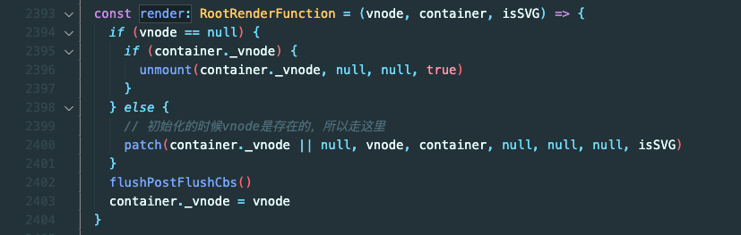

render 会调用 patch

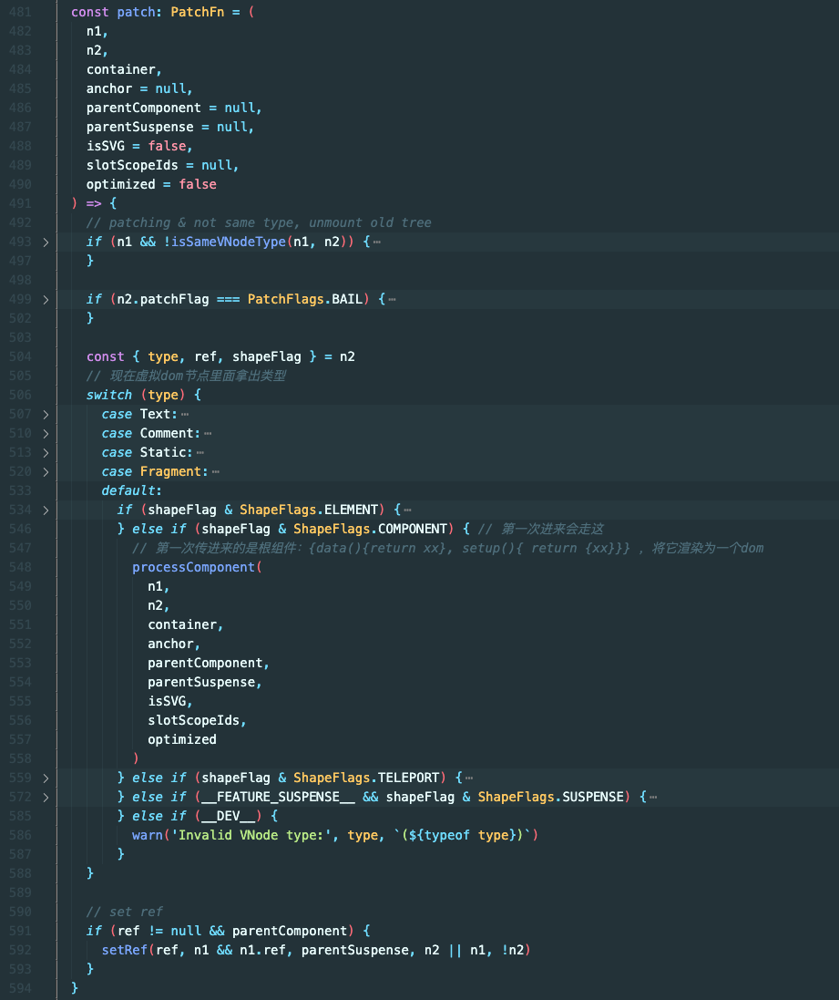

patch 第一次会走 processComponent

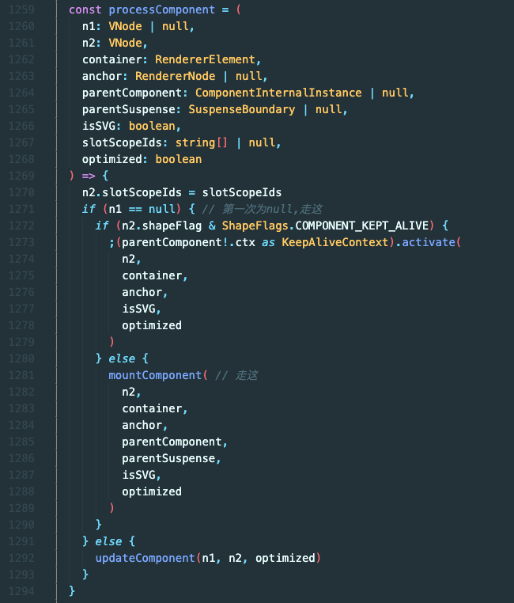

第一次 n1 为 null，会走 mountComponent

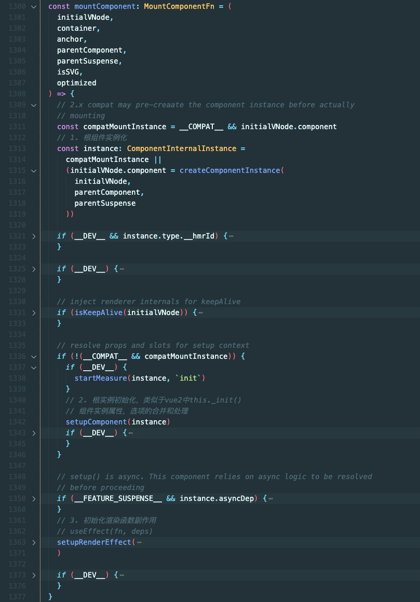

首次挂载：1.根组件实例化 2.初始化更组件 3.安装 render 函数副作用 setupRenderEffect

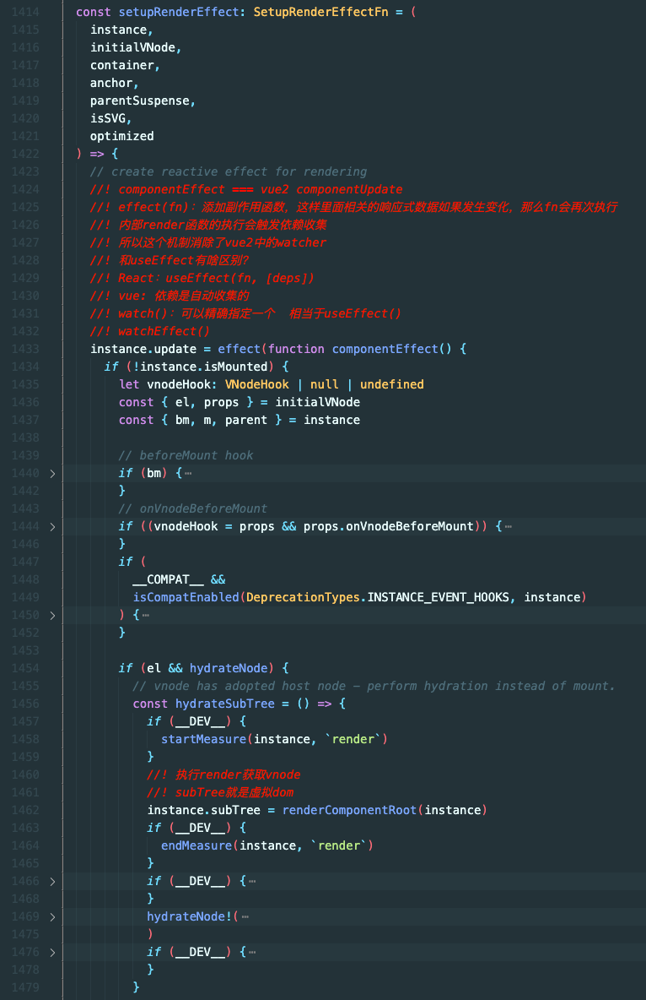

setupRenderEffect 中实际就只有一行代码`instance.update = effect(function componentEffect() {})`

这里和我们上面写的其实是一样的，我们是全量更新，这里做了虚拟 dom

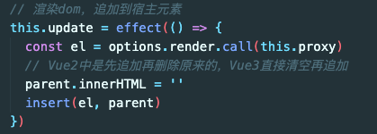

源码中，会判断 instance.isMounted，不是首次的话会进行 diff，手写版中也省略了

再看回 mountComponent 中的 setupComponent

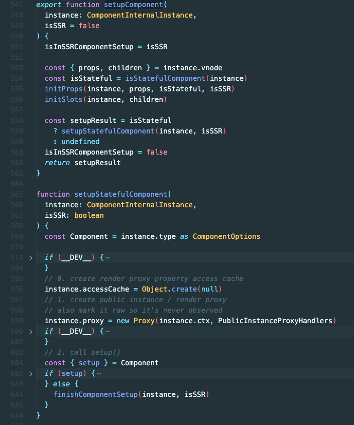

先是判断`isStatefulComponent`，是否是状态组件（有属性有 data），就会执行 setupStatefulComponent

setupStatefulComponent 会做一个数据的代理，这个和手写版中下面这段是一样的

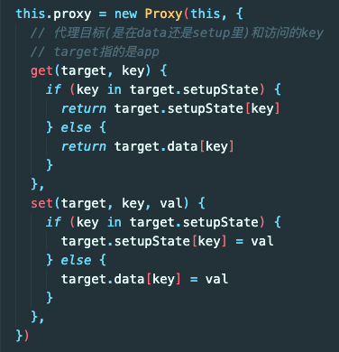

接着往下，判断 setup 是否存在，存在就执行 setup。无论 setup 是否存在，都会执行 finishComponentSetup，在 handleSetupResult 中同样也调用了

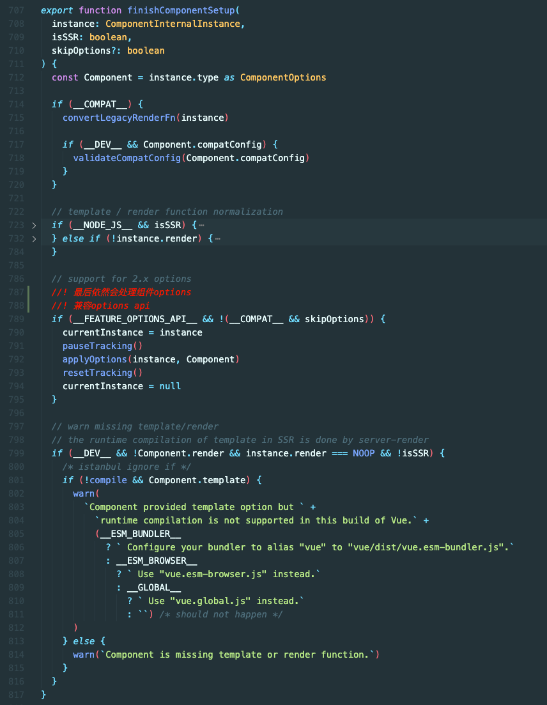

其中 options 无论如何都会处理（applyOptions）

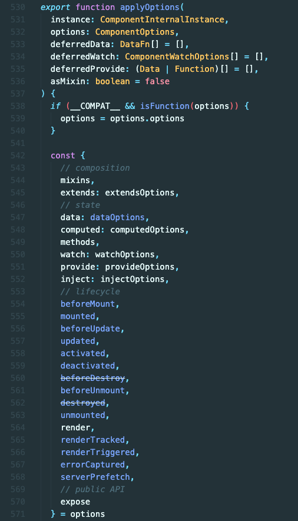

这里 data 被重命名为 dataOptions，找到他


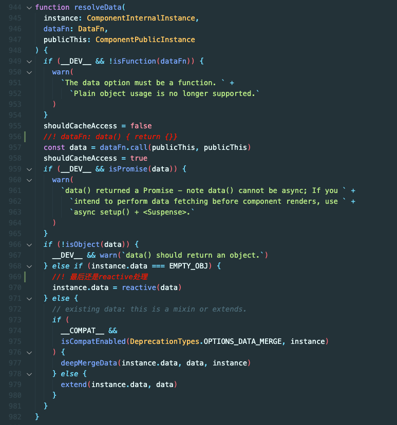

可以发现，不管是 setup 中使用`reactive()`主动的响应式，还是使用`data(){return{}}`的被动的响应式，最后都是 reactive 在对对象在做代理

#### reactivity

`packages/reactivity`Vue3 中把 reactive 被单独抽离出去成了 reactivity 这个模块
reactivity 可以单独发布到 npm 上，让人可以单独安装。

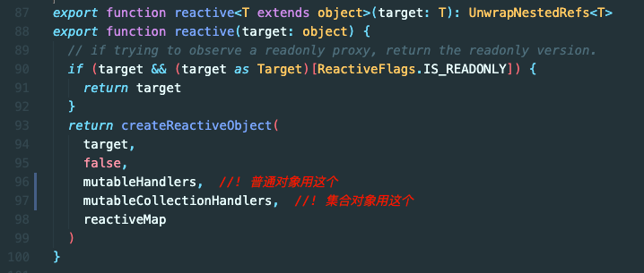

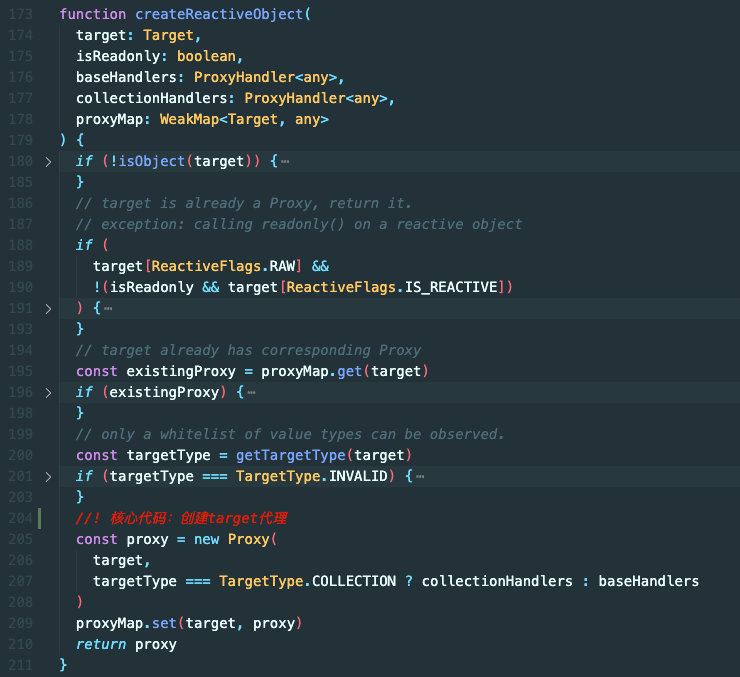

最终返回 proxy

数据的拦截结束，下面是副作用的添加

`packages/reactivity/src/effect.ts`

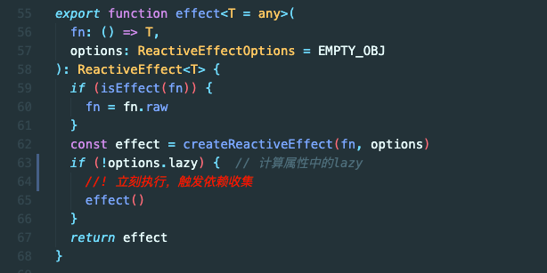

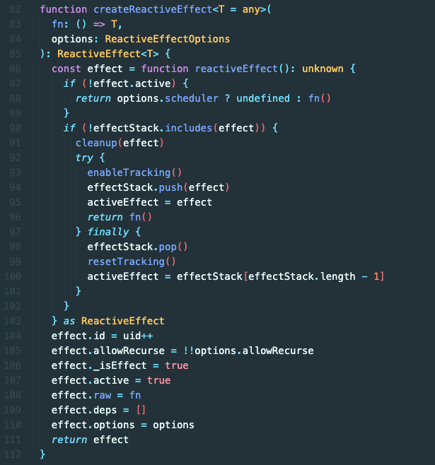

这里和手写版的 effect 是一样了

再来看下 track，和手写版基本一致

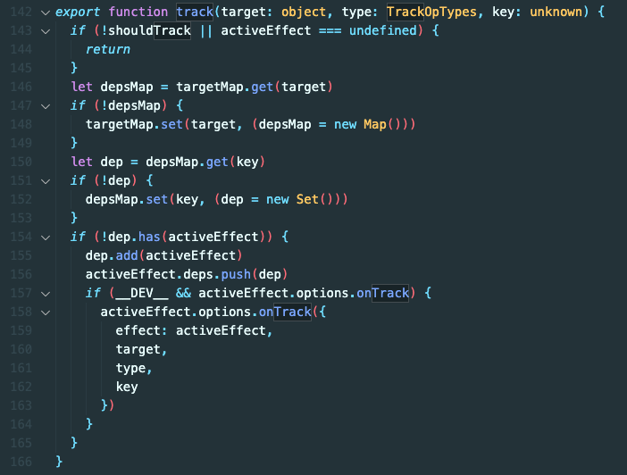

trigger 的话有些区别，为了防止数组的一些抖动问题，做了些特殊判断

不过目的依然是拿到依赖，去执行它们

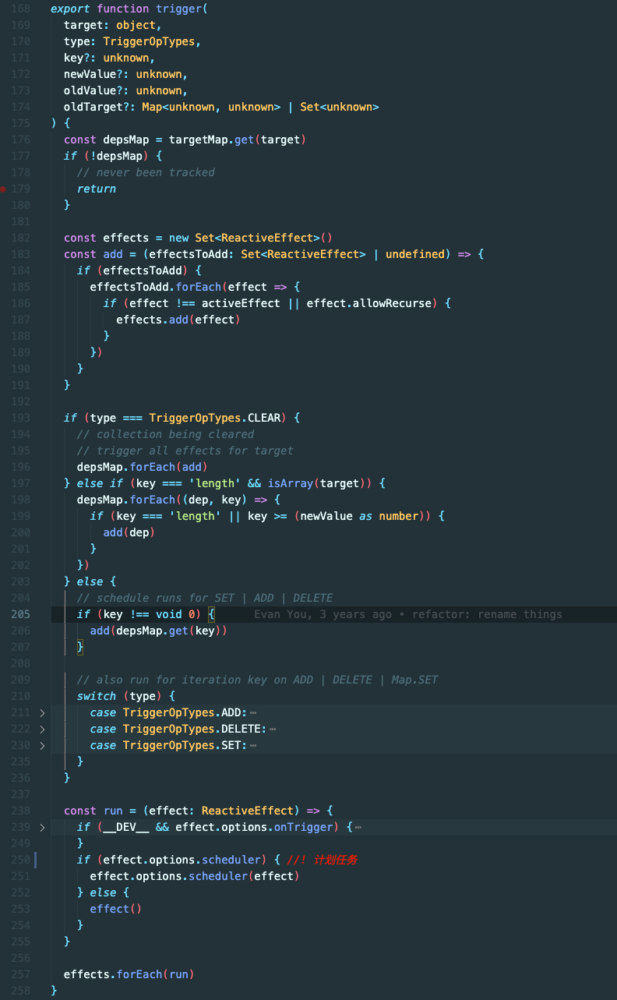

这里的 run 本质上就是执行 effect，除了用户在 options 上设置了 scheduler

**本文完**
