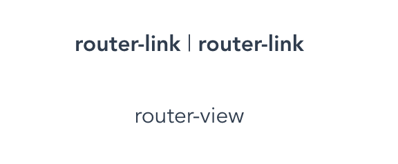

#### 准备工作

创建一个新的项目，`vue create vue-study`，选择 vue2，添加 vue-router 和 vuex，` vue add router``vue add vux `

#### vue-router

> Vue router 是 Vue.js 官方的路由管理器。它和 Vue 的核心深度集成，让构建单页面应用易如反掌

##### 核心步骤

```js
// src/router/index.js
// 使用vue-router插件
import VueRouter from 'vue-router'
Vue.use(VueRouter)
// 创建Router实例
const router = new VueRouter({
  routes
})
// src/main.js
// 在根组件上添加该实例
import router from './router'
new Vue({
  router,
  render: h => h(App)
}).$mount('#app')
// src/App.vue
// 添加路由视图
<router-view/>
// 导航
<router-link to="/">Home</router-link>
<router-link to="/about">About</router-link>
this.$router.push('/')
this.$router.push('/about')
```

##### 目标

- 实现一个插件
  - 实现 VueRouter 类
    - 处理路由选项
    - 监控 url 变化，hashchange
    - 响应这个变化
  - 实现 install 方法
    - $router注册（this.$router.push）
    - 两个全局组件（router-link,router-view）

##### 实现

为了检测后续成果，直接在`src/router/`下新建一个`vuerouter.js`，并将`src/router/index.js`中的`import VueRouter from 'vue-router'`改为`import VueRouter from './vuerouter'`。如果实现了目标，可以直接查看效果。

要实现一个 Vue 插件，要给当前类实现一个静态的`install`方法，`install`方法将来会被 vue 调用，该函数接收 Vue 构造函数。

```js
class VueRouter {}

VueRouter.install = function (_Vue) {}

export default VueRouter
```

为了组件中能够使用`this.$router.push()`，需要挂载路由器实例$router
需要实现`Vue.prototype.$router = router` router在`/src/router/index.js`的`const router = new VueRouter({ routes })`中传入 但是`Vue.use(VueRouter)`时会立刻调用`install`方法，在install执行时router实例还不存在 所以需要使用`Vue.mixin`

```js
let Vue
class VueRouter {}
// install.call(VueRouter, Vue) install调用时，如此传入_Vue
VueRouter.install = function (_Vue) {
  Vue = _Vue
  Vue.mixin({
    beforeCreate() {
      // 这些代码延迟到了组件实例化的时候才执行，这时就可以获取到组件选项了
      // 这些代码会在所有组件中都执行，但是只有在根实例中才有router，所以只在根实例中才执行如下代码
      if (this.$options.router) {
        Vue.prototype.$router = this.$options.router
      }
    },
  })
}

export default VueRouter
```

此时如果运行项目，会报错`Unknown custom element: <router-link>`和`Unknown custom element: <router-view>`

###### router-link

注册全局组件`router-view`和`router-link`

```js
let Vue
class VueRouter {}
// install.call(VueRouter, Vue) install调用时，如此传入_Vue
VueRouter.install = function(_Vue) {
  Vue = _Vue
  Vue.mixin({
    ...
  })

  Vue.component("router-link", {})
  Vue.component("router-view", {})
}

export default VueRouter
```

为组件添加`template`会报错，如下：

```js
Vue.component('router-link', {
  template: '<a>xxxx</a>',
})
```

```
[Vue warn]: You are using the runtime-only build of Vue where the template compiler is not available. Either pre-compile the templates into render functions, or use the compiler-included build.
```

当前环境是 webpack 的预打包版本，不包含编译器，所有不支持`template`

改为用`render(h){}`

```js
Vue.component('router-link', {
  // h是createElement，最终返回一个vdom
  render(h) {
    return h('a', 'router-link')
  },
})
Vue.component('router-view', {
  render(h) {
    return h('div', 'router-view')
  },
})
```

现在可以在页面上看到结果了


使用`router-link`时，正常是这么写的`<router-link to="/about">about</router-link>`

现在需要拿到`about`来替换上面占位的`router-link`

只需要使用`this.$slots.default`即可

还需要加上`to`属性，所以需要从`props`中传进来

这里实现`hash`的写法，给`href`添加`#`

```js
Vue.component('router-link', {
  props: {
    to: {
      type: String,
      required: true
    }
  }
  render(h) {
    return h('a', { attrs: { href: `#${this.to}` } }, this.$slots.default)
  },
})
```

这里也可以支持 jsx 的写法，不过不推荐，因为对当前执行环境有依赖，希望不配置 jsx 也能使用

jsx 写法如下：

```jsx
Vue.component('router-link', {
  props: {
    to: {
      type: String,
      required: true,
    },
  },
  render() {
    return <a href={`#${this.to}`}>{this.$slots.default}</a>
  },
})
```

🎉 router-link 完成

###### router-view

现在如果直接把组件拿过来，render 出来，就可以在页面上展示出来了

```js
import Home from '../views/Home.vue'
...
  Vue.component("router-view", {
    // h函数可以接收的参数除了字符串，也可以是组件的配置对象
    render(h) {
      return h(Home);
    },
  });
...
```

在创建实例的时候，传进来的`routes`里面包含了组件和 url 的映射关系`new VueRouter({routes: [...]})`

```js
class VueRouter {
  constructor(options) {
    // 保存一下，以便在router-view中拿，通过this.$router.$options拿
    // options就是 new VueRouter({routes: [...]}) 里面传过来的
    this.$options = options
  }
}
```

现在获取当前地址`current`，去掉 hash 的#就是了。`window.location.hash.slice(1) || "/"`

```js
class VueRouter {
  constructor(options) {
    ...
    this.current = window.location.hash.slice(1) || "/"
  }
}
...
  Vue.component("router-view", {
    render(h) {
      // 获取当前路由对应的组件
      let component = null
      const route = this.$router.$options.routes.find(
        (route) => route.path === this.$router.current
      );
      if (route) {
        component = route.component
      }
      return h(component);
    },
  });
...
```

现在打开页面，会发现刷新页面可以改变页面，点击路由却不会改变

1. 还没有监听的 hash 的改变
2. render 函数只执行一次，需要响应式

监听 hash，如下：

```js
class VueRouter {
  constructor(options) {
    // 监听hash变化
    window.addEventListener('hashchange', () => {
      this.current = window.location.hash.slice(1)
    })
  }
}
```

这里申明响应式属性的方式：

1. `new Vue({data: { current: ... }})`
2. `Vue.util.defineReactive`，这是隐藏api

```js
class VueRouter {
  constructor(options) {
    // 把current作为响应式数据
    // 将来发生变化，router-view的render函数能够再次执行
    const initial = window.location.hash.slice(1) || '/'
    Vue.util.defineReactive(this, 'current', initial)

    window.addEventListener('hashchange', () => {
      this.current = window.location.hash.slice(1)
    })
  }
}
```

🎉router-view完成

#### Vuex

> Vuex集中式存储管理应用的所有组件的状态，并以相应的规则保证状态以可预测的方式发生变化

未完待续