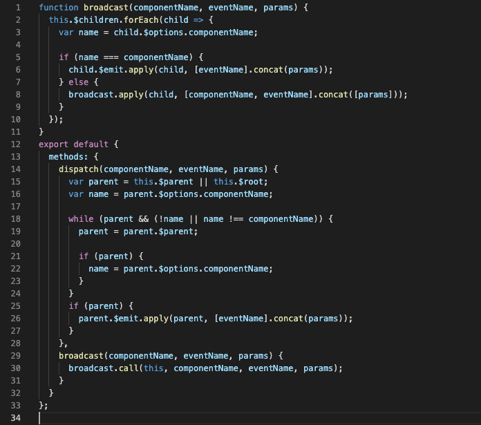
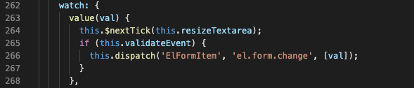
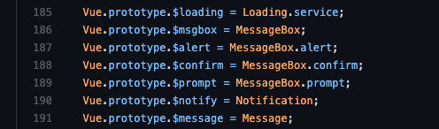

### 组件通信常用方式

- props
- $emit/$on
- event bus
- vuex

### 边界情况

- $parent
- $children
- $root
- $refs
- provide/inject
- 非 prop 特性
  - $attrs
  - $listeners

#### 事件总线的实现方式

原生实现

```js
class Bus {
  constructor() {
    this.callbacks = {}
  }
  $on(name, fn) {
    this.callbacks[name] = this.callbacks[name] || []
    this.callbacks[name].push(fn)
  }
  $emit(name, args) {
    if (this.callbacks[name]) {
      this.callbacks[name].forEach(cb => cb(args))
    }
  }
}
// main.js
Vue.prototype.$bus = new Bus()
// 使用
// child1
this.$bus.$on('foo', handle)
// chiild2
this.$bus.$emit('foo)
```

通常直接用 Vue 代替 Bus，因为 Vue 已经实现了$on和$emit

#### $parent/$root

兄弟组件之间通信可通过共同祖辈搭桥，$parent或$root

```js
// brother1
this.$parent.$on('foo', handle)
// brother2
this.$parent.$emit('foo')
```

#### $children

父组件可以通过$children 访问子组件实现父子通信

```js
// parent
this.$children[0].xx = 'xxx'
// $children不能保证子元素顺序
```

#### $refs

获取子节点引用

```js
// parent
<HelloWorld ref='hw'>

mounted() {
  this.$refs.hw.xx = 'xxx'
}
```

#### $attrs/$listeners

包含了父作用域中*不作为 prop 被识别*的特性绑定（class 和 style 除外）。当一个组件没有声明任何 prop 时，这里会包含所有父作用域的绑定（class 和 style 除外），并且可以通过`v-bind="$attrs"`传入内部组件，在创建高级别的组件时非常有用

非属性特性：没在 props 中声明，但是使用了的属性

```js
// child：并未在props中声明foo
<p>{{$attrs.foo}}</p>
// parent
<HelloWorld foo="foo" />
```

```js
// 给Grandson隔代传值
<Child2 msg="lalala" @some-event="onSomeEvent"></Child2>
// child2做展开
<Grandson v-bind="$attrs" v-on="$listeners"></Grandson>
// Grandson使用
<div @click="$emit('some-event', 'msg from grandson')">{{msg}}</div>
```

**可以使用`inheritAttrs: false`防止属性透传**

#### provide/inject

能够实现祖先和后代之间传值

```js
//
provide() {
  return { foo: 'foo' }
}
//
inject: ['foo']
```

官方中 provide/inject 不是响应式的，如果想实现响应式，只需要传入 this 就可以了

```js
provide() {
  return {
    grandpa: this
  }
}
```

inject 优先级高于 prop（inject > props > methods > data），如果重名，会报错

重命名及默认值

```js
inject: {
  foo2: 'foo'
}
inject: {
  foo: {
    from: 'foo',
    default: 'default foo'
  }
}
```

### 插槽

插槽语法是 Vue 实现的内容分发 API，用于复合组件开发。该技术在通用组件库开发中有大量应用。

#### 匿名插槽

```js
// comp1
<div>
  <slot></slot>
</div>

// parent
<comp>hello</comp>
```

#### 具名插槽

将内容分发到子组件指定位置

```js
// comp2
<div>
  <slot></slot>
  <slot name="content"></slot>
</div>
// parent
<comp2>
  <!-- 默认插槽用default做参数 -->
  <template v-slot:default>具名插槽</template>
  <!-- 具名插槽用插槽名做参数 -->
  <template v-slot:content>内容</template>
</comp2>
```

#### 作用域插槽

分发内容要用到子组件中的数据

```js
// comp3
<div>
  <slot :foo="foo"></slot>
</div>
// parent
<comp3>
  <!-- 把v-slot的值指定为作用域上下文对象 -->
  <template v-slot:default="slotProps">
    来自子组件数据：{{slotProps.foo}}
  </template>
</comp3>

```

### 实践

#### input

```html
<template>
  <div>
    <!-- 双绑：
    1.:value
    2.@input -->
    <input :type="type" :value="value" @input="onInput" v-bind="$attrs" />
  </div>
</template>

<script>
  export default {
    inheritAttrs: false,
    props: {
      value: {
        type: String,
        required: true,
      },
      type: {
        type: String,
        default: 'text',
      },
    },
    methods: {
      onInput(e) {
        this.$emit('input', e.target.value)

        // 通知校验
        this.$parent.$emit('validate')
      },
    },
  }
</script>
```

#### formItem

```html
<template>
  <div>
    <!-- 1.label -->
    <label v-if="label">{{ label }}</label>
    <!-- 1.5容器 -->
    <slot></slot>
    <!-- 2.校验错误信息 -->
    <p v-if="error">{{ error }}</p>
  </div>
</template>

<script>
  import Validator from 'async-validator'

  export default {
    inject: ['form'],
    props: {
      label: {
        type: String,
      },
      prop: String,
    },
    data() {
      return {
        error: '',
      }
    },
    mounted() {
      this.$on('validate', () => {
        this.validate()
      })
    },
    methods: {
      validate() {
        // 单项校验
        const value = this.form.model[this.prop]
        const rules = this.form.rules[this.prop]

        const validator = new Validator({ [this.prop]: rules })
        return new Promise((resolve, reject) => {
          validator.validate({ [this.prop]: value }, (errors) => {
            console.log(errors)
            if (errors) {
              this.error = errors[0].message
              reject()
            } else {
              this.error = ''
              resolve()
            }
          })
        })
      },
    },
  }
</script>
```

#### form

```html
<template>
  <div>
    <slot></slot>
  </div>
</template>

<script>
  export default {
    provide() {
      return {
        form: this,
      }
    },
    props: {
      model: {
        type: Object,
        required: true,
      },
      rules: Object,
    },
    methods: {
      validate(cb) {
        // 1.获取所有items，执行他们的validate，统一处理返回Promise
        const results = this.$children
          .filter((item) => item.prop)
          .map((item) => item.validate())
        console.log(results)
        Promise.all(results)
          .then(() => cb(true))
          .catch(() => cb(false))
      },
    },
  }
</script>
```

#### 使用 form

```html
<template>
  <div>
    <Form :model="model" :rules="rules" ref="loginForm">
      <FormItem label="用户名" prop="username">
        <Input v-model="model.username" placeholder="请输入用户名"></Input>
      </FormItem>
      <FormItem label="密码" prop="password">
        <Input v-model="model.password" placeholder="请输入"></Input>
      </FormItem>
      <FormItem>
        <button @click="onLogin">登录</button>
      </FormItem>
    </Form>
  </div>
</template>

<script>
import Input from "@/components/form/Input.vue";
import FormItem from "@/components/form/FormItem.vue";
import Form from "@/components/form/Form.vue";

export default {
  components: {
    Input,
    FormItem,
    Form
  },
  data() {
    return {
      model: {
        username: "tom",
        password: ''
      },
      rules: {
        username: [{ required: true, message: "用户名为必填项" }],
        password: [{ required: true, message: "密码为必填项" }],
      },
    };
  },
  methods: {
    onLogin() {
      this.$refs.loginForm.validate((isValidate) => {
        if (isValidate) {
          // 通过
          console.log('submit login');
        } else {
          alert('校验失败，请重试！')
        }
      })
    }
  },
};
</script>
```

在 input 中，这里使用的是`this.$parent.$emit('validate')`来处理的，这里不够健壮，在 ElementUI 中，使用了 dispatch 来处理的

[https://github.com/ElemeFE/element/blob/HEAD/src/mixins/emitter.js](https://github.com/ElemeFE/element/blob/HEAD/src/mixins/emitter.js)



在 dispatch 中，是递归向上查找父组件派发的，如果用在目前的例子中，就是如下写法：

```js
this.dispatch('FormItem', 'validate')
```

源码中的使用：[https://github.com/ElemeFE/element/blob/HEAD/packages/input/src/input.vue](https://github.com/ElemeFE/element/blob/HEAD/packages/input/src/input.vue)



dispatch 是通过 mixin 引入的

可以在源码中看一下 created 中对 prop 的处理。formItem 创建后发现有 prop 属性需要做校验，就 dispatch 一个`el.form.addField`事件，相当于注册。如果要执行校验，就直接访问 fields
[https://github.com/ElemeFE/element/blob/HEAD/packages/form/src/form.vue](https://github.com/ElemeFE/element/blob/HEAD/packages/form/src/form.vue)

### 实现弹窗组件

```js
import Vue from 'vue'

export default function create(Component, props) {
  // 创建Component组件实例
  const Ctor = Vue.extend(Component)
  const comp = new Ctor({
    propsData: props,
  })
  // 挂载
  // 这里需要注意，不能直接comp.$mount(document.body)，因为$mount实际上是在执行替换操作，会导致页面空白
  comp.$mount()
  // 手动追加
  document.body.appendChild(comp.$el)
  // 销毁方法
  comp.remove = function () {
    document.body.removeChild(comp.$el)
    comp.$destroy()
  }
  return comp
}
```

写个通知组件

```html
<template>
  <div class="box" v-if="isShow">
    <h3>{{title}}</h3>
    <p class="box-content">{{message}}</p>
  </div>
</template>
<script>
  export default {
    props: {
      title: {
        type: String,
        default: '',
      },
      message: {
        type: String,
        default: '',
      },
      duration: {
        type: Number,
        default: 1000,
      },
    },
    data() {
      return {
        isShow: false,
      }
    },
    methods: {
      show() {
        this.isShow = true
        setTimeout(this.hide, this.duration)
      },
      hide() {
        this.isShow = false
        this.remove()
      },
    },
  }
</script>
```

调用

```html
<script>
  import create from 'util/create'
  import Notice from 'components/Notice.vue'

  ...
  const notice = create(Notice, {
    title: '标题',
    message: '成功',
    duration: 2000
  })
  notice.show()
  ...
</script>
```

在平常使用类似组件时，我们是这样使用的：

```js
this.$notice({
  title: '标题',
  message: '成功',
  duration: 2000,
})
```

只需要在 main.js 中注册$notice 就可以了

```js
Vue.prototype.$notice = function (props) {
  const notice = create(Notice, props)
  notice.show()
}
```

elementUI 中就是用这种方式注册

[https://github.com/ElemeFE/element/blob/dev/src/index.js](https://github.com/ElemeFE/element/blob/dev/src/index.js)


