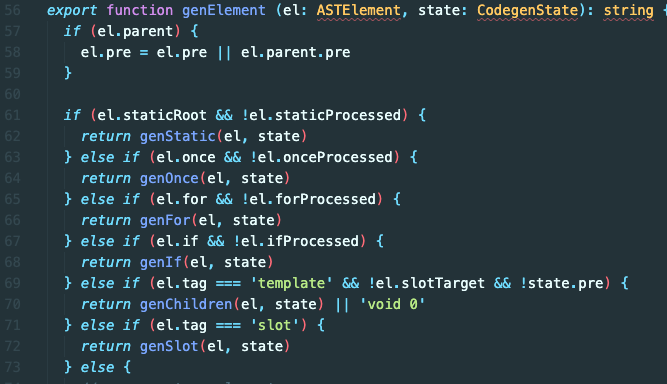
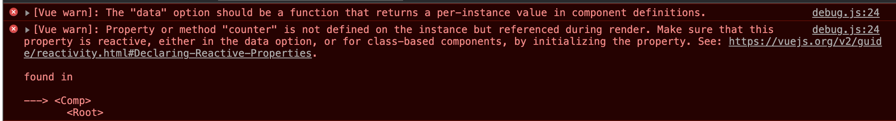
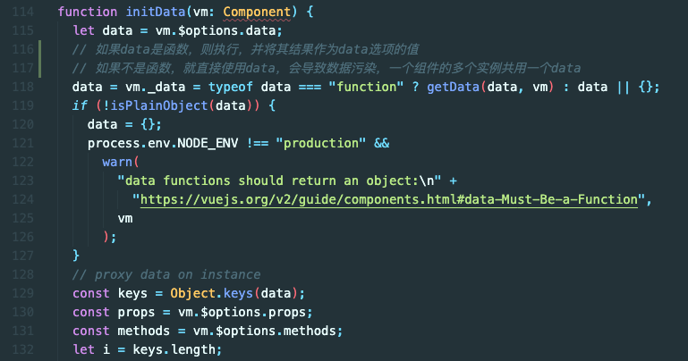
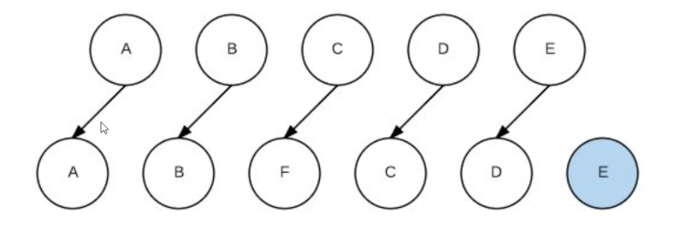

### 1. v-if 和 v-for 哪个优先级更高？如果两个同时出现，应该怎么优化得到更好的性能？

#### 简答：

- v-for 优先级更高
- 将 v-if 提取出来，可以用`<template v-if="condition"><div v-for="item in items"></div></template>`

#### 分析：

一个简单的例子，打印出渲染函数

```html
<html>
  <div id="demo">
    <!-- <p v-if="isShow" v-for="item in list">{{item.name}}</p> -->
    <template v-if="isShow">
      <p v-for="item in list">{{item.name}}</p>
    </template>
  </div>
  <script src="../../dist//vue.js"></script>
  <script>
    const app = new Vue({
      el: '#demo',
      data() {
        return {
          list: [
            {
              name: 'foo',
            },
            {
              name: 'bar',
            },
          ],
          isShow: true,
        }
      },
    })
    console.log(app.$options.render)
  </script>
</html>
```

此为不用 template 提取 v-if 的结果
其中`_l`是列表渲染函数，可以看出，在外层先执行了`_l`，再在其内部执行 isShow 的判断

```js
ƒ anonymous(
) {
with(this){return _c('div',{attrs:{"id":"demo"}},_l((list),function(item){return (isShow)?_c('p',[_v(_s(item.name))]):_e()}),0)}
}
```

此为使用 template 提取 v-if 的结果
外层先进行了 isShow 的判断，再执行内部的`_l`列表渲染

```js
ƒ anonymous(
) {
with(this){return _c('div',{attrs:{"id":"demo"}},[(isShow)?_l((list),function(item){return _c('p',[_v(_s(item.name))])}):_e()],2)}
}
```

源码位置：`src/compiler/codegen/index.js`



源码中就可以很明显的看到 v-for 是在 v-if 前面的

**如果需要根据 item 内属性的值来做 v-if，可以使用`computed`过滤出一个删选后的 list，再执行 v-for，如此便可提升性能**

#### 结论：

1. 显然 v-for 优先于 v-if 被解析
2. 如果同时出现，每次渲染都会先执行循环再判断条件，无论如何循环都不可避免，浪费了性能
3. 要避免同时出现，则在外层嵌套`template`，在这一层进行 v-if 判断，然后内部进行 v-for

### 2. Vue 组件 data 为什么必须是个函数而 Vue 的根实例则没有此限制？

#### 简答：

- 为了保证在多实例的时候状态相互不干扰
- 根实例只会有一个，所以不担心状态污染

#### 分析：

如果组件中 data 是个对象，此时会报错

```html
<html>
  <div id="demo">
    <comp></comp>
    <p>{{title}}</p>
  </div>
  <script src="../../dist//vue.js"></script>
  <script>
    Vue.component('comp', {
      template: `<div @click="counter++">{{counter}}</div>`,
      data: {
        counter: 1,
      },
      // data() {
      //   return {
      //     counter: 1
      //   }
      // }
    })
    const app = new Vue({
      el: '#demo',
      data: {
        title: '哈哈',
      },
    })
  </script>
</html>
```



源码位置：`src/core/instance/state.js`



源码中可以看到如果 data 是函数，则执行，并将其结果作为 data 选项的值，如果不是函数，就直接使用 data

**在组件中 data 使用对象，一个组件的多个实例会共用一个 data，会导致数据污染**

在根实例中使用则不会有问题，因为在创建根实例的时候都是通过`new`的方式创建的，在全局范围他是单例的，所以不会存在污染

`src/core/util/options.js`


- 数据初始化的时候会去检测 data 的形式，从而去执行具体的执行方式。
- 由于根实例在创建的时候，它会有实例，只有根实例才会有，所以它可以躲过关于 data 选项的校验。
- 而如果是一个普通的组件，由于它不存在实例，所以它无法躲过 if 逻辑校验

#### 结论：

- Vue 组件可能存在多个实例，如果使用对象形式定义 data，则会导致它们共用一个 data 对象，那么状态变更将会影响所有组件实例，这是不合理的。
- 采用函数形式定义，在 initData 时会将其作为工厂函数返回全新 data 对象，有效规避多实例之间状态污染问题。
- 而在 Vue 根实例创建过程中则不存在该限制，也是因为根实例只能有一个，不需要担心这种问题。

### 3. 你知道 vue 中 key 的作用和工作原理吗？说说你对他的理解

#### 分析：

例子：

```html
<html>
  <div id="demo">
    <p v-for="item in list">{{item}}</p>
  </div>
  <script src="../../dist/vue.js"></script>
  <script>
    const app = new Vue({
      el: '#demo',
      data() {
        return {
          list: ['a', 'b', 'c', 'd', 'e'],
        }
      },
      mounted() {
        setTimeout(() => {
          this.list.splice(2, 0, 'f')
        }, 2000)
      },
    })
  </script>
</html>
```

上面的例子中，没有 key 时`updateChildren`的执行



在没有 key 的情况下，会执行 3 次更新操作，一次插入操作
有 key 的情况下，在`updateChildren`时，只执行了一次插入操作

最直观的方式就是在`src/core/vdom/patch.js`的`updateChildren`方法内打上条件断点，看页面上元素的变化

算法在计算时，没有 key，就相当于 key 相同（都是 undefined），再判断标签、备注等（大多数情况下可以理解为标签一致就行了），此时标签一致，所以算法会认为这是同一个节点，然后再执行 patch

patch 的时候会比较新旧是否一致，如果一致不执行更新，不一致就执行更新，所以没 key 时候相当于对 f、c、d 进行了强制更新，最后再把 e 插入

关于源码中`updateChildren`的运行机制，移步[Vue2 源码解析二](https://yongmaple.com/2021/04/15/Vue2源码解析二/)

#### 结论：

1. key 的作用主要是为了高效的更新虚拟 dom，其原理是 vue 在 patch 过程中通过 key 可以精准判断两个节点是否是用一个，从而避免频繁更新不同元素，使得整个 patch 过程更加高效，减少 dom 操作量，提高性能。
2. 另外，若不设置 key 还可能在列表更新时引发一些隐蔽的 bug
3. vue 中使用相同标签名元素的过渡（transition）切换时，也会使用到 key 属性，其目的也是为了让 vue 可以区分它们，否则 vue 只会替代其内部属性而不会触发过渡效果

### 4. 怎么理解 vue 中的 diff 算法

#### 分析

1. 必要性： `src/core/instance/lifecycle.js`中的 mountComponent

- 组件中可能存在很多个 data 中的 key 使用

2. 执行方式： `src/core/vdom/patch.js`中的 patchVnode

- patchVnode 是 diff 发生的地方，整体策略：深度优先，同层比较

3. 高效性： `src/core/vdom/patch.js`中的 updateChildren

#### 结论

1. diff 算法是虚拟 dom 技术的必然产物：通过新旧虚拟 dom 作对比（即 diff），将变化的地方更新在真实 dom 上，另外也需要 diff 高效的执行对比过程，从何降低时间复杂度 O(n)
2. vue 2.x 中为了降低 Watcher 粒度，每个组件只有一个 Watcher 与之对应，只有引入 diff 才能精确找到发生变化的地方
3. vue 中 diff 执行的时刻是组件实例执行其更新函数时，它会比对上一次渲染结果 oldVnode 和新的渲染结果 newVnode，此过程称为 patch
4. diff 过程整体遵循深度优先、同层比较的策略。两个节点之间比较会根据它们是否拥有子节点或者文本节点做不同操作。比较两组子节点是算法的重点，首先假设头尾节点可能相同做 4 次比对尝试，如果没有找到相同节点才按照通用方式遍历查找，查找结束再按情况处理剩下的节点。借助 key 通常可以非常精确找到相同节点，因此整个 patch 过程非常高效

### 5. 对 vue 组件化的理解

#### 分析

1. 组件化定义
 - `Vue.component('comp', { template: '<div></div>'})`全局定义。源码位置：`src/core/global-api/assets.js`
 - `<template><div></div></template>` 单文件组件

2. 组件化优点

3. 组件化实现

