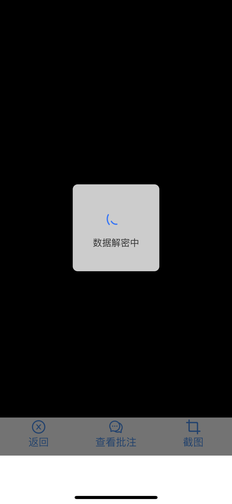
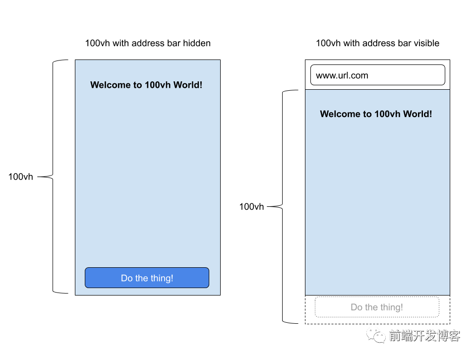

参考自[移动端避免使用100vh](https://blog.csdn.net/lgno2/article/details/109446447)
#### 复现：
钉钉H5开发，使用`dd_full_screen=true&showmenu=false`设置为全屏，在iphoneX上，高度不足，底部缺失部分

#### 原因：
核心问题是移动浏览器（我正在为您浏览，Chrome和Safari）具有“帮助”功能，其中地址栏有时可见，有时隐藏，从而改变了视口的可见大小。这些浏览器没有将100vh高度调整为视口高度变化时屏幕的可见部分，而是将100vh设置为浏览器的高度，并隐藏了地址栏。结果是，当地址栏可见时，屏幕的底部将被切除。

如下所示：

当显示地址栏时，由于移动浏览器错误地将100vh设置为屏幕高度而没有显示地址栏，因此屏幕底部被切断。在上图中，应隐藏在屏幕底部的按钮。更糟糕的是，当用户首次访问移动设备上的网站时，地址栏将在顶部可见，因此默认的体验是破碎的体验。

#### 解决：
使用window.innerHeight动态设置高度